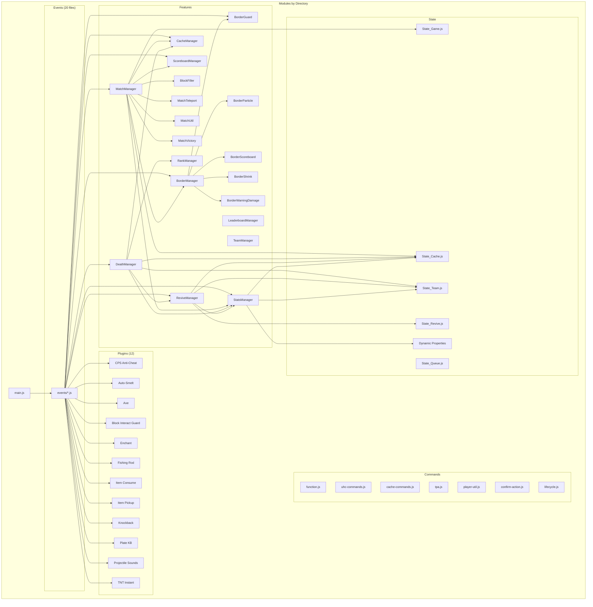
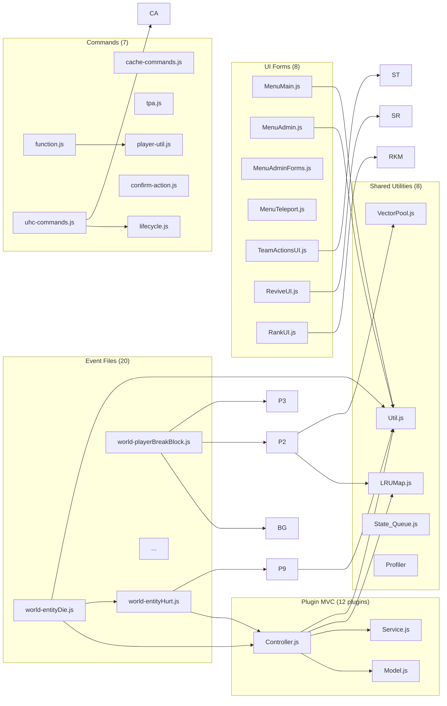

# UHCRun — Architectural Reverse Engineering

# PHASE 1 — SYSTEM UNDERSTANDING

> Understand the whole project before making any suggestions.
> Build a mental model of folder architecture, module dependencies, runtime lifecycle, event flow, tick systems, state management, caches, scoreboards, Dynamic Properties, entities, UI, teams, and matches.
> Never refactor before understanding everything.

## 1. Project Overview

| Property | Value |
|----------|-------|
| **Name** | UHCRUN B26BETA03 |
| **Type** | Ultra Hardcore Battle Royale addon for Minecraft Bedrock Dedicated Server |
| **API** | `@minecraft/server` 2.9.0-beta, `@minecraft/server-ui` 2.2.0-beta |
| **Engine** | Minecraft Bedrock 1.26.30+ |
| **Files** | ~106 JS files, ~7,800 lines |
| **Runtime** | ES modules, no build step, no TypeScript |
| **Teams** | 9 teams (Red, Blue, Yellow, Green, Purple, Aqua, Orange, Gray, Pink) |
| **Max Players** | 54 |

---

## 2. Folder Architecture

```
scripts/
├── main.js                          # Entry point — side-effect imports all 20 event modules
├── commands/                        # Custom slash commands + utilities
│   ├── function.js                  # CommandMap registry (10 commands)
│   ├── uhc-commands.js             # UHC lifecycle commands (setup/start/end/reset)
│   ├── cache-commands.js           # Cache inspection commands
│   ├── tpa.js                      # Teleport player teleport menu
│   ├── player-util.js              # Batch operations (batch, cmd, setItemPlayer, etc.)
│   ├── confirm-action.js           # Reusable confirmation dialog
│   └── lifecycle.js                # Mutex lock for lifecycle operations
├── constants/                       # Frozen configuration constants
│   ├── game.js                     # CONFIG, TEAMS, TICKING_AREAS, SPAWN_CONFIG, REVIVE_MSG
│   └── leaderboard.js              # Leaderboard NPC config, hash-based change detection
├── events/                          # 20 event wiring modules (side-effect imports)
│   ├── system-startup.js           # system.beforeEvents.startup → register commands, init caches
│   ├── system-runInterval.js       # system.runInterval → cleanup + hit registry pruning
│   ├── world-entityDie.js          # → HandlerOnDeath
│   ├── world-entityHurt.js         # → HandlerOnHurt + knockback
│   ├── world-entityHitEntity.js    # → anticheatCPS
│   ├── world-entityItemPickup.js   # → itemPickup
│   ├── world-entitySpawn.js        # → blockInteractGuard
│   ├── world-itemCompleteUse.js    # → itemConsumeEffects
│   ├── world-itemUse.js            # → revive + compass menu
│   ├── world-playerBreakBlock.js   # → borderGuard (before)
│   ├── world-playerBreakBlockAfter.js  # → autoSmelt + axe (after)
│   ├── world-playerHotbarSelectedSlotChange.js  # → enchant
│   ├── world-playerInteractWithBlock.js  # → borderGuard + blockInteractGuard (before)
│   ├── world-playerInteractWithEntity.js # → borderGuard + cancelNPC (before)
│   ├── world-playerLeave.js        # → purge caches + cancel revives
│   ├── world-playerPlaceBlock.js   # → borderGuard (before)
│   ├── world-playerPlaceBlockAfter.js  # → tntInstant (after)
│   ├── world-playerSpawn.js        # → cache registration + team restore + spectator
│   ├── world-pressurePlatePush.js  # → plateKnockback
│   └── world-projectileHitEntity.js  # → fishingRod + hitSounds
├── features/                        # Core game systems (6 domains)
│   ├── border/                     # Border system (6 files, ~890 lines)
│   ├── block-filler/               # Async block filling (7 files, ~1,200 lines)
│   ├── cache/                      # State management (3 files, ~460 lines)
│   ├── leaderboard/                # NPC leaderboard (3 files, ~330 lines)
│   ├── match/                      # Match lifecycle (5 files, ~1,230 lines)
│   ├── rank/                       # Cross-match persistence (2 files, ~300 lines)
│   ├── revive/                     # Player revival (4 files, ~620 lines)
│   ├── stats/                      # Statistics + death tracking (3 files, ~840 lines)
│   └── team/                       # Team management (4 files, ~830 lines)
├── plugin/                          # MVC plugins (12 plugins, 36 files)
│   ├── anticheat-cps/              # CPS detection (Controller/Model/Service)
│   ├── auto-smelt/                 # Ore auto-smelting
│   ├── axe/                        # Tree capitator
│   ├── block-interact-guard/       # Container access control
│   ├── enchant/                    # Auto-enchant tools
│   ├── fishing-hod/                # Fishing rod PvP
│   ├── item-consume-effects/       # Food effects
│   ├── item-pickup/                # Item pickup transformation
│   ├── knockback/                  # Custom knockback
│   ├── plate-knockback/            # Crimson plate launcher
│   ├── projectile-hit-sounds/      # Hit sound feedback
│   └── tnt-instant/                # Instant TNT
├── shared/                          # Shared utilities (8 files)
│   ├── Util.js                     # Core utilities (knockback, toast, location pool, logging)
│   ├── LRUMap.js                   # TTL-based LRU cache
│   ├── VectorPool.js               # Object pool for {x,y,z} vectors
│   ├── State_Queue.js              # Shared death + item vacuum queues
│   └── profiler/                   # Tick budget profiler (5 files)
│       ├── index.js                # Entry + auto-enable
│       ├── wrapper.js              # wrapTick / wrapGenerator
│       ├── state.js                # Shared state + flush logic
│       ├── reporter.js             # 30s report scheduling
│       └── tps.js                  # TPS sampling
└── ui/                              # Player-facing UI forms
    ├── menu/
    │   ├── MenuMain.js             # Main menu router
    │   ├── MenuAdmin.js            # Admin menu (11 options)
    │   ├── MenuAdminForms.js       # Admin sub-forms
    │   ├── MenuTeleport.js         # Teleport GUI
    │   └── MenuInfo.js             # Credits, Features, Ranks
    ├── rank/
    │   └── RankUI.js               # Rank leaderboard (4 tabs)
    ├── revive/
    │   └── ReviveUI.js             # Revive player selection
    └── team/
        └── TeamActionsUI.js        # Team selection GUI
```

---

## 3. Runtime Lifecycle

### 3.1 Boot Sequence

```
main.js (entry point)
  ├── system.beforeEvents.startup → HandlerCustomCommands (registers 10 commands)
  ├── system.run(renderBoard)      → NPC leaderboard render
  ├── system.run(HandlerStartupTeam) → cache rebuild + scoreboard init
  └── system.run(HandlerStartupStats) → load teamStats + playerStats from DP
```

### 3.2 Command Registration

All 10 commands registered in `system.beforeEvents.startup` via `customCommandRegistry.registerCommand()`:

| Command | Permission | Handler |
|---------|-----------|---------|
| `addon:uhcsetup` | GameDirectors | `uhcSetup` → structure load, ticking areas, gamerules, NPCs |
| `addon:uhcstart` | GameDirectors | `uhcStart` → scatter, game loop, border |
| `addon:uhcend` | GameDirectors | `uhcEnd` → cleanup, restore gamerules |
| `addon:uhcreset` | GameDirectors | `uhcReset` → full wipe |
| `addon:tpa` | Any | `tpa` → teleport menu |
| `addon:gui` | GameDirectors | `openMainMenu` → admin GUI |
| `addon:profiler` | GameDirectors | `toggleProfiler` |
| `addon:check` | GameDirectors | `uhcCheck` → dump cache sizes |
| `addon:clear` | GameDirectors | `uhcClear` → clear match caches |
| `addon:clearall` | GameDirectors | `uhcClearAll` → clear all including stats |

### 3.3 UHC Match Lifecycle

```
addon:uhcstart → confirmAction → beginLifecycle → MatchManager.startGameUhc()
  ├── initializeGameState()
  │   ├── ctx.isRunning = true
  │   ├── BorderManager.init() + resetBorderState() + scoreboardInit()
  │   └── setGameRunningState(true)
  ├── setupPlayers() → batch(6/tick): clearItems + applyStartState
  └── gameLoopRun() → system.runInterval (20 ticks)
       ├── ctx.uhcTick++
       ├── borderTick → check shrink checkpoints
       ├── borderShrink → animate radius
       ├── scoreboardUpdate (every 2 ticks)
       ├── borderDamage (batched 1/5 players per tick)
       ├── particleRender (every 4 ticks)
       ├── gameLoopHandleWorldStart → scatter teleport, PVP countdown
       └── gameLoopPlayersTick → setup + display bars
```

---

## 4. Event Flow Architecture

### 4.1 Side-Effect Import Pattern

Every `events/world-*.js` file is a side-effect module. `main.js` imports all 20, each subscribing to one `world.beforeEvents.*` or `world.afterEvents.*` event at module evaluation time.

### 4.2 Handler Dispatch Pattern

```js
world.afterEvents.someEvent.subscribe((event) => {
   runEventHandlers('Tag', handlerArray, event);
});
```

`runEventHandlers` wraps each handler in try/catch — one failure never blocks others.

### 4.3 Before vs After Events

| Event | Type | Handlers |
|-------|------|----------|
| `playerBreakBlock` | **before** | `borderGuard` (cancel outside border) |
| `playerBreakBlock` | **after** | `autoSmelt` + `axe` |
| `playerPlaceBlock` | **before** | `borderGuard` |
| `playerPlaceBlock` | **after** | `tntInstant` |
| `playerInteractWithBlock` | **before** | `borderGuard` + `blockInteractGuard` |
| `playerInteractWithEntity` | **before** | `borderGuard` + `cancelNPC` |
| `entityHurt` | **after** | `trackHit` + `knockback` |
| `entityDie` | **after** | `handleDeath` |

---

## 5. Tick Systems

### 5.1 Global Intervals (system-runInterval.js)

| Interval | Period | Purpose |
|----------|--------|---------|
| `handlerHit` | 200 ticks (10s) | Prune expired entries from `hitRegistry` |
| `cleanupAll` | 100 ticks (5s) | TTL cleanup for plugin Model caches + orphan purge |

### 5.2 Game Loop (MatchManager.gameLoopRun)

| Period | Purpose |
|--------|---------|
| 20 ticks (1s) | Border tick, shrink, scoreboard, damage, particles, PVP countdown |

### 5.3 Block Filler Loop

| Period | Purpose |
|--------|---------|
| `FILL_INTERVAL_TICKS` (via `system.runTimeout`) | Process fill queue, retry queue, layered tasks |

### 5.4 Revive Tick

| Period | Purpose |
|--------|---------|
| 5 ticks | Update revive sessions, validate conditions, apply progress |

### 5.5 Scoreboard Update

| Period | Purpose |
|--------|---------|
| 2 ticks (throttled within game loop) | Update sidebar lines (radius, time, players, alive teams, state) |

### 5.6 Particle Render

| Period | Purpose |
|--------|---------|
| 4 ticks | Border particle rendering (adaptive LOD) |

---

## 6. State Management

### 6.1 Global State Files

| File | State | Pattern |
|------|-------|---------|
| `State_Game.js` | `isGameRunning`, scoreboard objs, dirty flags | Exported `let` + setter functions |
| `State_Team.js` | `TEAM_LOOKUP`, `teamCounts`, `teamPlayerIndex`, `playerStats`, `teamStats`, `deathLocation` | Exported `Map`s + setter functions |
| `State_Revive.js` | `reviveSessions`, `reviverSessions`, `reviverCooldown` | Exported `Map`s + interval ID |
| `State_Cache.js` | `playerTeamCache`, `hitRegistry`, `multiKill`, `killStreak`, `playerCache`, `inventoryCache`, `uhcPlayerIds`, `allPlayersCache`, `uhcPlayersCache` | Exported `Map`s/`Set`s/arrays |
| `State_Queue.js` | `itemVacuumQueue`, `deathQueue` | Shared queue state |

### 6.2 Border Context (`ctx`)

The `GameContext()` factory creates a mutable context object shared between all border subsystems:

```js
ctx = {
   isRunning, isDestroyed, uhcTick, checkInterval,
   cachedDimension, prevShowCoordinates,
   borderReady, borderRadius, nextShrinkIndex, nextShrinkTick,
   targetRadius, wbBounds, shrinkStartTick, shrinkDuration,
   startRadius, currentBorderColor, endSeqState, endSeqStartTick,
   objective, borderDamageIndex, cacheRetryTick, countdownIntervalId
}
```

### 6.3 Render Cache

Separate from `ctx` — only read/written by renderers (Scoreboard, Particle):

```js
renderCache = {
   aliveTeamBarCache, aliveTeamDirty,
   lastBorderRadius, lastPlayerCount, lastTargetRadius,
   borderMolang, scoreboardUpdateThrottle
}
```

---

## 7. Cache Systems

### 7.1 Player Caches (State_Cache.js)

| Cache | Type | Key | Purpose |
|-------|------|-----|---------|
| `playerCache` | Map<id, Player> | player.id | Online player objects |
| `allPlayersCache` | Array<Player> | — | All players who joined |
| `uhcPlayersCache` | Array<Player> | — | Players with 'uhc' tag |
| `allPlayersCacheIds` | Set<id> | — | Quick lookup for all player IDs |
| `uhcPlayerIds` | Set<id> | — | Quick lookup for UHC player IDs |
| `playerTeamCache` | Map<id, teamId> | player.id | Team assignment |
| `inventoryCache` | Map<id, Container> | player.id | Inventory container reference |
| `hitRegistry` | Map<victimId, entry> | victim.id | Recent damage sources (8s timeout) |
| `multiKill` | Map<killerId, data> | killer.id | Multi-kill tracking (16s timeout) |
| `killStreak` | Map<killerId, count> | killer.id | Kill streak counter |

### 7.2 Cache Lifecycle

```
HandlerStartupTeam()
  → refreshPlayerCaches()         // rebuild all from world.getPlayers()
  → rebuildTeamRuntimeState()     // rebuild teamCounts + teamPlayerIndex

HandlerOnSpawn()
  → playerCache.set(id, player)
  → allPlayersCache.push + allPlayersCacheIds.add
  → uhcPlayersCache.push + uhcPlayerIds.add (if 'uhc' tag)

HandlerOnLeave / purgePlayerCacheOnLeave()
  → removePlayerFromRuntimeState(id, teamId, fullCleanup)
  → removeCachedPlayerById(allPlayersCache, id)
  → allPlayersCacheIds.delete + uhcPlayerIds.delete
  → inventoryCache.delete + hitRegistry.delete + multiKill.delete + killStreak.delete
```

### 7.3 Orphan GC (every 100 ticks)

```js
purgeOrphanInventoryCache()  // delete entries not in allPlayersCacheIds
purgeOrphanPlayerCache()     // delete entries not in allPlayersCacheIds
```

### 7.4 Plugin TTL Caches (LRUMap)

| Plugin | Cache | TTL |
|--------|-------|-----|
| `auto-smelt` | `toolCache` | TTL-based |
| `enchant` | `lastEnchantTick` | TTL-based |
| `anticheat-cps` | `playerState` | TTL-based |
| `knockback` | `kbThrottle` | TTL-based |

---

## 8. Scoreboard Systems

### 8.1 Objectives

| Objective | Display Slot | Content |
|-----------|-------------|---------|
| `uhcBoard` | Sidebar | Border radius, time, players, alive teams, state icon |
| `uhc_kills` | List | Per-player kill count |
| `uhc_deaths` | BelowName | Per-player death count |
| `uhc_teamkills` | — | Per-team kill count (used by leaderboard) |
| `kdhistory` | — | Kill history pairs (Killer → Victim) |

### 8.2 Sidebar Lines (5 lines)

| Line | Content | Change Detection |
|------|---------|-----------------|
| 0 | `Border {current}/{next}` | `lastBorderRadius` + `lastTargetRadius` |
| 1 | Time to next shrink / "NOW" | Always updated |
| 2 | `Players {count}` | `lastPlayerCount` |
| 3 | Alive team colored blocks | `aliveTeamDirty` flag |
| 4 | State icon (Hourglass/Shield/Sword) | Always updated |

### 8.3 Score Caching

`BorderScoreboard` maintains a `scoreCache` Map. Lines are only re-scored when content changes — prevents unnecessary `removeParticipant` + `setScore` calls.

---

## 9. Dynamic Property Systems

### 9.1 Per-Player DPs

| Key | Type | Purpose |
|-----|------|---------|
| `uhcrun:team` | string | Player's team ID |

### 9.2 World DPs

| Key | Type | Size Limit | Purpose |
|-----|------|------------|---------|
| `uhc_teamStats` | JSON string | ~900KB | Team kills/deaths |
| `uhc_playerStats` | JSON string | ~900KB | Player kills/deaths/name/teamId |
| `uhc_playerNames` | JSON string | — | Player ID → name mapping |
| `uhc_ranks` | JSON string | ~900KB | Cross-match rank data |
| `uhc_profiler_enabled` | boolean | — | Profiler toggle |

### 9.3 Save Strategy

- **Stats**: Debounced save (60 ticks) via `scheduleSaveStats()`. Sets `statsDirty` flag, batches team stats then player stats with 2-tick gap.
- **Ranks**: Save on `flushIfDirty()` — called at game end via `endGameUhc()`.
- **Player Names**: Immediate save on `recordPlayerName()`.

### 9.4 UTF-8 Size Guard

`StatsManager.js` implements pure-JS `utf8ByteLength()` (no `TextEncoder` in Bedrock JS engine). Checks JSON size before writing — skips save if >900KB.

---

## 10. Border System (6 Components)

### 10.1 BorderManager (Orchestrator)

Delegates to 5 sub-components. Manages `ctx` (shared game context) and `renderCache`.

### 10.2 BorderShrink

- 16 checkpoint radii: `[500, 450, 400, 350, 300, 250, 200, 150, 100, 80, 50, 25, 16, 10, 5, 2]`
- 6-tier shrink config: `[targetRadius, shrinkDuration, restTime]`
- Linear interpolation during shrink: `newRadius = start + (target - start) * progress`
- Color changes: blue → red during shrink, red → blue on completion

### 10.3 BorderGuard

Event-based guard. Cancels block break/place/interaction outside border:
- **Global limit**: ±500 blocks from origin
- **Dynamic limit**: Current border radius
- **Place-block lock**: Active when border ≤16 and end sequence past PATTERN1

### 10.4 BorderParticle

- Adaptive LOD: reduces view distance when >20 players
- Cell-based grouping: 16×16 grid, max 54 groups
- Two render modes: AABB projection (large border), 4-point (small border <100)
- Cached Molang variables (color + size key)
- Renders every 4 ticks

### 10.5 BorderScoreboard

Cache-aware line updates. Only re-renders changed lines.

### 10.6 BorderWarningDamage

Batched damage: `damage = min(5, distance_outside × 0.2)`. Processed in batches (players/5 per tick).

---

## 11. Block Filler System (7 Components)

### 11.1 Architecture

```
BlockFiller (orchestrator)
  ├── BlockFillerFillQueue (async queue + time budgeting)
  ├── BlockFillerPatternEnqueue (layered pattern tasks)
  ├── BlockFillerTaskBuilder (task creation + bound splitting)
  ├── BlockFillerEndSequence (5-state end game)
  ├── BlockFillerConstants (mode enum + state machine)
  └── BlockFillerUtil (PRNG, block cache, bounds splitting)
```

### 11.2 End Sequence State Machine

```
INITIAL_WAIT (100 ticks)
  → PATTERN3 (nether wall, queued via fillQueue)
  → PATTERN1 (outer ring clear, uses fillBlocks directly)
  → COOLDOWN (100 ticks)
  → PATTERN2 (inner ring clear, uses fillBlocks directly)
  → COMPLETED
```

State advancement requires: no pending work + 40 tick minimum elapsed.

### 11.3 Fill Queue

- Time-budgeted: checks `system.currentTick` boundary between iterations
- Normal mode: 48 iterations/tick, processes every 2 ticks
- Endgame mode: 80 iterations/tick, processes every tick
- Retry queue with exponential backoff (12→60 ticks)
- Hard caps: 8000 queue slots, 80000 pending blocks, 250k blocks/task

### 11.4 Pattern Tasks

3 pattern tasks constructed in `BlockFiller` constructor:
- `pattern_1`: Outer ring clear (±16 to ±9), 4 segments
- `pattern_2`: Inner ring clear (±8 to ±3), 4 segments
- `pattern_3`: Nether wall (±17), 4 segments, uses nether blocks

---

## 12. Death Processing Pipeline

```
entityDie → HandlerOnDeath → handleDeath(player)
  ├── cancelReviveForPlayer(id)
  ├── resolveKiller(id) + resolveDeathCause(id)
  ├── processVictimDeath()
  │   ├── removePlayerFromAliveRuntimeState()
  │   ├── recordSurvivedLast() (if last in team)
  │   ├── setDeathLocation()
  │   ├── spawn death particles
  │   ├── remove 'uhc' tag + setSpectator
  │   ├── deferred: spawn player_head + hopper minecart + item vacuum
  │   ├── increment victim deaths + team deaths
  │   └── scheduleSaveStats()
  ├── processKillerRewards()
  │   ├── incrementPairHistory()
  │   ├── increment killer kills + team kills
  │   ├── mergePlayerStats() → rank data
  │   ├── handleFirstBlood() (once per match)
  │   ├── handleMultiKill() (Double→Triple→Quadra→Ace)
  │   └── handleKillStreak()
  ├── hitRegistry.delete(id)
  └── showDeathScreenshot() → enqueue death UI batch
```

### 12.1 Death UI Batching

Death UI messages are queued and processed in batches (5 normal, 10 burst if >20 pending) to avoid watchdog timeouts.

---

## 13. Revive System

### 13.1 Flow

```
Player uses player_head → onUseReviveItem → openReviveUI
  → Select dead teammate → tryStartRevive
  → validateReviveStart (8 checks)
  → startRevive (creates session)
  → updateRevives (runs every 5 ticks)
      → validate conditions each tick
      → check movement (< 1 block)
      → finishRevive (on success)
          → consume head item
          → teleport target to reviver
          → setSurvival + addTag('uhc')
          → add regen II + resistance V
          → update team counts
          → scheduleSaveStats
```

### 13.2 Constraints

- Duration: 8 seconds (160 ticks)
- Cooldown: 18 seconds (360 ticks)
- Cancel on: move >1 block, dimension switch, item loss, team change
- 1:1 mapping: reviver → target (tracked in `reviverSessions`)

---

## 14. Teleport System

### 14.1 2-Phase Scatter

1. **Phase 1 (Leaders)**: Teleport team leaders to Y=200 (preload chunks), 1 per tick
2. **Phase 2 (Members)**: After 5-tick settle, teleport members to safe Y (detected via `getTopmostBlock`), 1 every 3 ticks

### 14.2 Position Generation

Evenly distributed around center at configurable radius (default 490):
```js
angle = randomOffset + i * (2π / teamCount)
x = center.x + cos(angle) * radius
z = center.z + sin(angle) * radius
```

### 14.3 Safe Y Detection

- `getTopmostBlock()` → check for liquid → place glass if needed
- LRU cache (256 entries) prevents repeated lookups
- Fallback: DEFAULT_Y (120) on chunk-load failures

---

## 15. Rank System

### 15.1 Cross-Match Persistence

Stored in `uhc_ranks` Dynamic Property (JSON, max 900KB):

```json
{
  "players": {
    "playerName": { "kills": 5, "deaths": 2, "wins": 1, "games": 3, "survivedLast": 1 }
  },
  "teams": {
    "team1": { "points": 12, "placements": {"1": 1, "3": 2}, "games": 3 }
  }
}
```

### 15.2 Placement Points (PUBG-style)

| Placement | Points |
|-----------|--------|
| #1 | 5 |
| #2 | 4 |
| #3 | 3 |
| #4 | 2 |
| #5+ | 1 |

### 15.3 Rank Tiers

| Tier | Color | KD Range |
|------|-------|----------|
| Unranked | §7 | < 0.5 |
| Bronze | §6 | 0.5–1.0 |
| Silver | §f | 1.0–1.5 |
| Gold | §e | 1.5–2.5 |
| Diamond | §b | 2.5–4.0 |
| Master | §5 | ≥ 4.0 |

---

## 16. Plugin MVC Pattern

All 12 plugins follow:

```
plugin/<name>/
├── Controller.js    // Event handlers, calls Model + Service
├── Model.js         // Constants, state Maps, TTL caches with cleanup()
└── Service.js       // Business logic, side effects
```

### 16.1 Plugin Catalog

| Plugin | Controller Events | Model State | Service Logic |
|--------|------------------|-------------|---------------|
| anticheat-cps | entityHitEntity, playerLeave, playerSpawn | circular buffer (24), MAX_CPS=20 | count, kick, warn, alert |
| auto-smelt | playerBreakBlock, playerLeave | BLOCK_ACTION_MAP, toolCache LRU | getCachedTool, executeAction |
| axe | playerBreakBlock, playerLeave | MAX_LOGS=16, MAX_LEAVES=64 | BFS tree scan, queue-based |
| block-interact-guard | playerInteractWithBlock, entitySpawn | BLOCK_DENYLIST, SPECTATOR_DENYLIST | handleEnderChest, isDoorLike |
| enchant | playerHotbarSelectedSlotChange, playerLeave | TOOLS map, ENCHANT_WINDOW_TICKS=3 | buildEnchantedItem |
| fishing-hod | projectileHitEntity | HOOK_ID, CAST_SOUND | applyKnockback (h:1.25, v:0.38) |
| item-consume-effects | itemCompleteUse | — | handleConsume |
| item-pickup | entityItemPickup | PENDING_MAX=32 | onPickup |
| knockback | entityHurt, playerLeave | PLAYER type, kbThrottle | applyKnockback (h:0.18, v:0.32) |
| plate-knockback | pressurePlatePush | PLATE_TYPES, PLATE config | nextSound (alternates 3) |
| projectile-hit-sounds | projectileHitEntity | PROJECTILES list | resolveShooter, playHitSound |
| tnt-instant | playerPlaceBlock, playerLeave | TNT type, GLOBAL_CAP=8 | placeTnt |

---

## 17. Performance Patterns

### 17.1 Batch Processing

All player operations use batched `system.runTimeout` to spread work across ticks:
- `_batchSetupPlayers(players, index, 6)` — 6 players per tick
- `_batchResetPlayerStates(players, index, 10)` — 10 players per tick
- `_batchResetAllPlayers(players, index, 6)` — 6 players per tick

### 17.2 Object Pooling

- `createLoc(x, y, z)` / `freeLoc(loc)` — location object pool (reduces GC pressure)
- `VectorPool` — 500 pre-allocated `{x,y,z}` objects

### 17.3 Change Detection

- `renderCache` tracks last known values to avoid redundant operations
- `scoreCache` in BorderScoreboard prevents redundant score updates
- `borderMolang` cached by color+size key
- `aliveTeamDirty` flag pattern for team bar updates

### 17.4 Tick Budget Profiling

`wrapTick('label', fn)` wraps any function with timing:
- Sub-ms precision via batch averaging
- Tick-crossing detection
- 30s report intervals with EMA smoothing
- Per-label stats: avg, max, calls, total, peak, cross

### 17.5 LRU Caches with TTL

`LRUMap` class used by plugin Models:
- Max size cap
- TTL-based expiration
- Cleanup called every 100 ticks

### 17.6 Swap-Remove

`removeCachedPlayerById(list, id)` uses swap-with-last + pop for O(1) removal from arrays.

---

## 18. Shared Utilities

### 18.1 dynamicToast

```js
dynamicToast(msg, icon, bg)
// Uses §N§O§T§I§F§I§C§A§T§I§O§N prefix to trigger vanilla toast UI
// msg padded to 500 chars, icon/bg to 100 chars
```

### 18.2 Knockback System

```js
KB = { horizontal: 0.18, vertical: 0.32, maxHorizontal: 1.2 }
applyKnockbackXZ(entity, nx, nz, h, v, maxH)
applyKnockbackFromDelta(entity, fromX, fromZ, toX, toZ, h, v)
```

### 18.3 Location Pool

```js
createLoc(x, y, z)  // Pop from pool or create new
freeLoc(loc)         // Push back to pool
```

---

## 19. UI Systems

All UI uses `@minecraft/server-ui` (`ActionFormData`, `MessageFormData`). No client-side JSON UI for gameplay logic.

### 19.1 Menu Hierarchy

```
openMainMenu (compass use)
  ├── Teleport Menu (addon:tpa)
  ├── Team Manager
  ├── Features
  ├── Credits
  ├── Ranks
  └── Admin (conditional on 'admin' tag)
      ├── Player List
      ├── Kill History
      ├── Clear Teams
      ├── Teleport
      ├── Team Manager
      ├── Dynamic Properties
      ├── Map Dump
      ├── Player Status
      ├── UHC Player List
      ├── Team Stats
      └── Death Locations
```

---

## 20. Critical Execution Flows

### 20.1 Most Complex Flow: Match Start

```
addon:uhcstart → confirmAction → beginLifecycle
  → MatchManager.startGameUhc()
    → initializeGameState() — reset ctx, border, scoreboard
    → setupPlayers() — batched clear + apply start state
    → gameLoopRun() — system.runInterval every 20 ticks
      → borderTick (shrink checkpoints)
      → borderShrink (linear interpolation)
      → scoreboardUpdate (cache-aware, every 2 ticks)
      → borderDamage (batched 1/5 per tick)
      → particleRender (adaptive LOD, every 4 ticks)
      → worldStart sequence (scatter teleport → PVP countdown → enable PVP)
      → playersTick (setup bars, sounds, gamemode transitions)
```

### 20.2 Most Complex Flow: Death Processing

```
entityDie → handleDeath
  → resolveKiller (hitRegistry lookup with 8s timeout)
  → processVictimDeath (remove from alive, spawn particles, spectator, item vacuum)
  → processKillerRewards (stats, multi-kill, first blood, streak)
  → showDeathScreenshot (queued batch UI)
```

### 20.3 Most Complex Flow: End Sequence

```
borderTick → ctx.nextShrinkIndex >= CHECKPOINTS.length
  → endSequenceTick (state machine)
    → INITIAL_WAIT (100 ticks)
    → PATTERN3 (nether wall via fillQueue, layer-by-layer)
    → PATTERN1 (outer ring via fillBlocks, top-down)
    → COOLDOWN (100 ticks)
    → PATTERN2 (inner ring via fillBlocks, bottom-up)
    → COMPLETED
```

### 20.4 Most Complex Flow: Revive

```
Player head use → openReviveUI → select teammate
  → tryStartRevive → validateReviveStart (8 checks)
  → startRevive (session created, tick started)
  → updateRevives (every 5 ticks)
    → validate: alive, has item, dead, same team, same dimension, no movement
    → finishRevive: consume item, teleport, apply effects, update caches
```

---

## 21. Hard Constraints

1. **No `TextEncoder`/`TextDecoder`** in Bedrock JS engine — use pure-JS UTF-8 byte length
2. **Dynamic Property size limit**: ~900KB per key
3. **Watchdog**: Can terminate scripts exceeding tick budgets
4. **No hot reload**: Full BDS restart required after script changes
5. **ES module caching**: BDS caches modules in memory
6. **Player IDs as Map keys**: Do not rely on player objects persisting across events
7. **`beforeEvents` mutation**: Can cancel events but limited API surface
8. **`afterEvents` side effects**: Must be careful with entity validity

---

## 22. Dependency Graph

```
main.js
  └── events/* (20 files) → features/*, plugin/*, shared/*

features/border/BorderManager.js
  ├── border/BorderGuard.js
  ├── border/BorderParticle.js
  ├── border/BorderScoreboard.js
  ├── border/BorderShrink.js
  ├── border/BorderWarningDamage.js
  └── block-filler/BlockFiller.js

features/match/MatchManager.js
  ├── border/BorderManager.js
  ├── block-filler/BlockFiller.js
  ├── cache/CacheManager.js
  ├── cache/State_Cache.js
  ├── match/MatchTeleport.js
  ├── match/MatchUtil.js
  ├── match/MatchVictory.js
  ├── match/State_Game.js
  ├── rank/RankData.js
  ├── stats/ScoreboardManager.js
  ├── stats/StatsManager.js
  └── team/State_Team.js

features/stats/DeathManager.js
  ├── cache/CacheManager.js
  ├── cache/State_Cache.js
  ├── rank/RankData.js
  ├── revive/ReviveManager.js
  ├── stats/StatsManager.js
  └── team/State_Team.js

features/revive/ReviveManager.js
  ├── cache/State_Cache.js
  ├── match/State_Game.js
  ├── stats/StatsManager.js
  ├── team/State_Team.js
  └── revive/State_Revive.js
```

---

## 23. Data Flow Summary

```
Player Action
  → Event (before/after)
  → runEventHandlers (try/catch per handler)
  → Handler (feature/plugin)
  → State mutation (Map.set, DP.set)
  → Cache invalidation (dirty flags)
  → Renderer pickup (scoreboard, particles, toast)
  → Persistence (debounced DP save)
```

---

## 24. Architecture Strengths

1. **Isolated event wiring**: Each event file is self-contained, side-effect imported
2. **Try/catch per handler**: One handler failure never blocks others
3. **Batch processing**: All player loops spread across ticks to avoid watchdog
4. **Cache-first reads**: Player data read from Maps, not `world.getPlayers()`
5. **Change-detection rendering**: Scoreboard/particles only update when data changes
6. **Debounced persistence**: Stats saved with 60-tick debounce, not every mutation
7. **Object pooling**: Location objects and vectors recycled to reduce GC
8. **Profiler integration**: Tick budget visibility for performance tuning
9. **Swap-remove**: O(1) array element removal for player lists
10. **TTL-based caches**: Plugin caches auto-expire stale entries

## 25. Architecture Risks

1. **Mutable shared `ctx`**: Single object mutated by 6+ subsystems — race conditions possible if tick ordering changes
2. **No module isolation**: All state is global exports — circular dependencies possible
3. **DP size limit**: Stats JSON could exceed 900KB with 54 players over many games
4. **No automated tests**: All verification is manual in-game
5. **Tick ordering dependency**: Game loop assumes specific sub-system execution order
6. **Cache consistency**: Multiple caches (playerCache, allPlayersCache, uhcPlayersCache) must stay in sync manually

# PHASE 2 — FLOW ANALYSIS

> Identify every execution flow. For EVERY flow calculate: function calls, call depth, cyclomatic complexity, branches, loops, state mutations, API calls, DP access, scoreboard access, cache lookups, tick frequency, estimated CPU cost, estimated memory allocations.

## 26. Complete Flow Analysis — All Execution Flows

Every flow is traced from trigger to terminal state with exact metrics.

---

### FLOW 1: Player Join (playerSpawn)

**Trigger**: `world.afterEvents.playerSpawn`

```
runEventHandlers('PlayerSpawn', 5 handlers, event)
├── [1] recordPlayerName(player)
│   ├── loadPlayerNames()              → world.getDynamicProperty + JSON.parse
│   ├── map[player.id] = player.name
│   └── persistPlayerNames(map)        → JSON.stringify + world.setDynamicProperty
├── [2] recordScoreboardId(player)     → _sbIdToUuid.set(scoreboardIdentity.id, player.id)
├── [3] HandlerOnSpawn(ev)
│   ├── playerCache.set(id, player)    → Map.set
│   ├── player.getDynamicProperty(key) → DP read
│   ├── playerStats.get(id)            → Map.get
│   ├── setPlayerStats(id, ps)         → Map.set
│   ├── allPlayersCache.push + allPlayersCacheIds.add
│   ├── [if uhc] uhcPlayersCache.push + uhcPlayerIds.add
│   ├── [if !initialSpawn] deathLocation.get(id) → player.teleport
│   ├── [if gameRunning + not uhc] setSpectator + addEffect
│   ├── [if initialSpawn + !gameRunning] teleportToSpawn + setAdventure
│   └── [if hasTeam] setTeam(player, teamId)
│       ├── player.setDynamicProperty  → DP write
│       ├── playerTeamCache.set        → Map.set
│       ├── addToTeamIndex             → Set.add
│       ├── patchPlayerStats           → Map.set
│       ├── markNametagDirty           → Set.add + system.runTimeout
│       ├── syncTag                    → player.hasTag + removeTag + addTag
│       └── aliveTeamDirtyHandler()    → callback
├── [4] anticheatCps.onPlayerSpawn(ev)
│   └── [if admin] model.adminPlayers.set(id, player)
└── [5] matchManager.handlePlayerSpawn(ev)
    └── [if running + interval null] gameLoopRun()
```

| Metric | Value |
|--------|-------|
| **Function calls** | 32–38 |
| **Max call depth** | 5 |
| **Cyclomatic complexity** | 12 |
| **Branches** | 14 (initialSpawn, gameRunning, hasTag, hasTeam, etc.) |
| **Loops** | 0 |
| **State mutations** | 11 (playerCache, allPlayersCache, allPlayersCacheIds, uhcPlayersCache, uhcPlayerIds, playerTeamCache, playerStats, teamCounts, teamPlayerIndex, nametagDirty, dynamicProperty) |
| **External API calls** | 5 (getDynamicProperty, setDynamicProperty, hasTag, addTag, removeTag) |
| **Dynamic Property access** | 2 (read team, write team) |
| **Scoreboard access** | 0 |
| **Cache lookups** | 8 (playerCache, allPlayersCache, allPlayersCacheIds, uhcPlayerIds, playerTeamCache, playerStats, deathLocation, teamCounts) |
| **Tick frequency** | Event-driven (per player join) |
| **Estimated CPU cost** | ~0.3ms per spawn |
| **Estimated memory allocations** | 1 Map entry, 1 Set entry, 1 array push |

---

### FLOW 2: Player Leave (playerLeave)

**Trigger**: `world.afterEvents.playerLeave`

```
runEventHandlers('PlayerLeave', 8 handlers, event)
├── [1] HandlerOnLeave(ev)
│   ├── cancelReviveForPlayer(id)
│   │   ├── reviverSessions.get(id)    → Map.get
│   │   ├── cancelReviveSession(targetId)
│   │   │   ├── reviveSessions.delete  → Map.delete
│   │   │   ├── reviverSessions.delete → Map.delete
│   │   │   └── resolvePlayer + sendMessage + playSound
│   │   └── reviverCooldown.delete     → Map.delete
│   └── purgePlayerCacheOnLeave(id)
│       ├── playerTeamCache.get(id)     → Map.get
│       ├── removePlayerFromRuntimeState(id, teamId, true)
│       │   ├── removeFromTeamIndex     → Set.delete
│       │   ├── teamCounts.set          → Map.set
│       │   ├── playerTeamCache.delete  → Map.delete
│       │   ├── playerCache.delete      → Map.delete
│       │   ├── hitRegistry.delete      → Map.delete
│       │   ├── deleteDeathLocation     → Map.delete
│       │   ├── multiKill.delete        → Map.delete
│       │   ├── killStreak.delete       → Map.delete
│       │   └── uhcPlayerIds.delete     → Set.delete
│       ├── removeCachedPlayerById(allPlayersCache, id) → swap-remove
│       ├── allPlayersCacheIds.delete   → Set.delete
│       ├── removeCachedPlayerById(uhcPlayersCache, id) → swap-remove
│       ├── inventoryCache.delete       → Map.delete
│       ├── deleteDeathLocation         → Map.delete
│       ├── deletePlayerStats           → Map.delete
│       └── aliveTeamDirtyHandler()     → callback
├── [2] matchManager.handlePlayerLeave(ev)
│   └── [if running + empty] stopGameLoop → system.clearRun
├── [3] anticheatCps.onPlayerLeave     → model.playerState.delete + adminPlayers.delete
├── [4] autoSmelt.onPlayerLeave        → Model.toolCache.delete
├── [5] axe.onPlayerLeave              → lastFellTick.delete + playerJobCount.delete + lastEnqueueTick.delete
├── [6] enchant.onPlayerLeave          → lastEnchantTick.delete
├── [7] knockback.onPlayerLeave        → kbThrottle.delete
└── [8] tntInstant.onPlayerLeave       → playerCooldown.delete
```

| Metric | Value |
|--------|-------|
| **Function calls** | 28–35 |
| **Max call depth** | 5 |
| **Cyclomatic complexity** | 10 |
| **Branches** | 8 (teamId check, isCounted, running, empty, etc.) |
| **Loops** | 0 |
| **State mutations** | 16 (playerTeamCache, teamCounts, teamPlayerIndex, playerCache, hitRegistry, deathLocation, multiKill, killStreak, uhcPlayerIds, allPlayersCache, allPlayersCacheIds, uhcPlayersCache, inventoryCache, playerStats + 7 plugin caches) |
| **External API calls** | 0 |
| **Dynamic Property access** | 0 |
| **Scoreboard access** | 0 |
| **Cache lookups** | 6 (playerTeamCache, allPlayersCache, allPlayersCacheIds, uhcPlayerIds, inventoryCache, deathLocation) |
| **Tick frequency** | Event-driven (per player leave) |
| **Estimated CPU cost** | ~0.2ms |
| **Estimated memory allocations** | 0 (all deletes) |

---

### FLOW 3: Player Break Block (before)

**Trigger**: `world.beforeEvents.playerBreakBlock`

```
runEventHandlers('PlayerBreakBlock', 1 handler, event)
└── border.handlePlayerBreakBlock(ev)
    ├── isOutsideGlobalLimit(block, player)
    │   ├── Math.abs(block.x) > 500 → return true
    │   └── Math.abs(block.z) > 500 → return true
    ├── [if outside global] ev.cancel = true → return
    ├── shouldCancelBorderAction(player, block)
    │   ├── [if !ctx.isRunning] → return false
    │   ├── [if !ctx.wbBounds] → return false
    │   ├── borderManagerIsOutside(x, z)
    │   │   └── ctx.wbBounds bounds check
    │   └── isUhcPlayer(player)
    │       └── uhcPlayerIds.has(id) → Set.has
    └── [if should cancel] ev.cancel = true
```

| Metric | Value |
|--------|-------|
| **Function calls** | 6–8 |
| **Max call depth** | 4 |
| **Cyclomatic complexity** | 6 |
| **Branches** | 5 (global limit x2, isRunning, wbBounds, isUhc) |
| **Loops** | 0 |
| **State mutations** | 0 (reads only) |
| **External API calls** | 0 |
| **Dynamic Property access** | 0 |
| **Scoreboard access** | 0 |
| **Cache lookups** | 2 (uhcPlayerIds.has, ctx.wbBounds) |
| **Tick frequency** | Event-driven (per block break) |
| **Estimated CPU cost** | ~0.02ms |
| **Estimated memory allocations** | 0 |

---

### FLOW 4: Player Break Block (after) — Auto-Smelt

**Trigger**: `world.afterEvents.playerBreakBlock`

```
runEventHandlers('PlayerBreakBlockAfter', 2 handlers, event)
├── [1] axe.onPlayerBreakBlock(ev)
│   └── service.onPlayerBreakBlock(ev)
│       ├── getHeldItem(player) → getPlayerInventoryContainer → container.getItem
│       ├── [if not axe] → return
│       ├── [if not log] → return
│       ├── checkCooldown(playerId) → lastFellTick.get + system.currentTick
│       ├── enqueueTreeJob(player, dim, x, y, z, logType, leafType, axeTypeId)
│       │   ├── [if queue full] → return false
│       │   ├── [if player jobs full] → return false
│       │   ├── [if cooldown active] → return false
│       │   ├── jobQueue.push → Array.push
│       │   ├── adjustPlayerJobCount → Map.set
│       │   └── scheduleJobs()
│       │       └── system.runJob(*breakTreeJob) → generator
│       │           ├── scanTrunk (BFS up + down)
│       │           ├── scanLeaves (BFS with hash)
│       │           ├── breakLogBlocks (generator, yields per batch)
│       │           └── breakLeafBlocks (generator, yields per batch)
└── [2] autoSmelt.onPlayerBreakBlock(ev)
    ├── BLOCK_ACTION_MAP.get(blockType) → Map.get
    ├── [if no action] → return
    ├── getCachedTool(player) → toolCache.get + inventoryCache
    ├── [if invalid tool] → return
    └── executeAction(player, location, action, dimension)
        ├── playSound
        ├── [if REDSTONE] handleRedstone → addXp + healPlayer + tryAbsorption
        ├── [if EFFECT] handlePremiumBlockEffect → addEffect + setActionBar + playSound
        └── scheduleBatch → pendingJobs.set + system.runTimeout(2)
            └── flushBatch → dimension.getEntities + processItem loop
```

| Metric | Value |
|--------|-------|
| **Function calls** | 18–25 (axe) + 12–18 (auto-smelt) |
| **Max call depth** | 6 (axe) / 5 (auto-smelt) |
| **Cyclomatic complexity** | 14 (axe) / 10 (auto-smelt) |
| **Branches** | 10 (axe) / 8 (auto-smelt) |
| **Loops** | 3 (axe trunk scan, leaf BFS, break loop) / 2 (auto-smelt entity scan, spawn loop) |
| **State mutations** | 5 (jobQueue, playerJobCount, lastFellTick, lastEnqueueTick, activeJobs) + 3 (toolCache, pendingJobs, scheduledDims) |
| **External API calls** | 4 (getComponent, getItem, setPermutation, spawnItem) + 3 (getComponent, getItem, addEffect) |
| **Dynamic Property access** | 0 |
| **Scoreboard access** | 0 |
| **Cache lookups** | 4 (toolCache, inventoryCache, jobQueue, playerJobCount) |
| **Tick frequency** | Event-driven (per block break) |
| **Estimated CPU cost** | ~0.5ms (axe) + ~0.3ms (auto-smelt) |
| **Estimated memory allocations** | 1 job object, 1 array entry, 1 ItemStack |

---

### FLOW 5: Player Place Block (before)

**Trigger**: `world.beforeEvents.playerPlaceBlock`

```
runEventHandlers('PlayerPlaceBlock', 1 handler, event)
└── border.handlePlayerPlaceBlock(ev)
    ├── isOutsideGlobalLimit(block, player) → 2× Math.abs checks
    ├── [if outside] ev.cancel = true → return
    ├── shouldLockPlaceBlock(player)
    │   ├── [if !ctx.isRunning] → return false
    │   ├── [if borderRadius > 16] → return false
    │   ├── [if endSeqState < PATTERN1] → return false
    │   └── isUhcPlayer(player) → uhcPlayerIds.has
    └── [if locked] ev.cancel = true
```

| Metric | Value |
|--------|-------|
| **Function calls** | 6–7 |
| **Max call depth** | 3 |
| **Cyclomatic complexity** | 6 |
| **Branches** | 5 (global x2, isRunning, radius, endSeq, isUhc) |
| **Loops** | 0 |
| **State mutations** | 0 |
| **External API calls** | 0 |
| **Dynamic Property access** | 0 |
| **Scoreboard access** | 0 |
| **Cache lookups** | 2 (uhcPlayerIds.has, ctx properties) |
| **Tick frequency** | Event-driven (per block place) |
| **Estimated CPU cost** | ~0.02ms |
| **Estimated memory allocations** | 0 |

---

### FLOW 6: Player Place Block (after) — TNT Instant

**Trigger**: `world.afterEvents.playerPlaceBlock`

```
runEventHandlers('PlayerPlaceBlockAfter', 1 handler, event)
└── tntInstant.onPlayerPlaceBlock(ev)
    ├── [if not tnt] → return
    ├── playerCooldown.get(playerId) → Map.get
    ├── [if cooldown active] → return
    ├── playerCooldown.set(playerId, tick+2) → Map.set
    ├── globalTntCount++ → [if > 8] → return
    ├── block.setType('air') → remove placed TNT
    └── dimension.spawnEntity('tnt') → primed TNT
```

| Metric | Value |
|--------|-------|
| **Function calls** | 7 |
| **Max call depth** | 2 |
| **Cyclomatic complexity** | 4 |
| **Branches** | 3 (not tnt, cooldown, global cap) |
| **Loops** | 0 |
| **State mutations** | 2 (playerCooldown, globalTntCount) |
| **External API calls** | 2 (setType, spawnEntity) |
| **Dynamic Property access** | 0 |
| **Scoreboard access** | 0 |
| **Cache lookups** | 1 (playerCooldown.get) |
| **Tick frequency** | Event-driven (per tnt place) |
| **Estimated CPU cost** | ~0.05ms |
| **Estimated memory allocations** | 0 |

---

### FLOW 7: Player Interact With Block (before)

**Trigger**: `world.beforeEvents.playerInteractWithBlock`

```
runEventHandlers('PlayerInteractWithBlock', 2 handlers, event)
├── [1] border.handlePlayerInteractWithBlock(ev)
│   ├── isOutsideGlobalLimit(block, player) → 2× Math.abs
│   ├── [if outside] ev.cancel = true
│   ├── shouldCancelBorderAction → ctx checks + isUhcPlayer
│   └── [if cancel] ev.cancel = true
└── [2] blockInteractGuard.onPlayerInteractWithBlock(ev)
    ├── [if ender_chest] → service.handleEnderChest
    │   ├── applyKnockbackXZ → entity.applyKnockback
    │   ├── addEffect (blindness)
    │   └── playSound
    ├── [if BLOCK_DENYLIST.has(typeId)] → ev.cancel = true
    └── [if spectator + denylist] → ev.cancel = true + setActionBar
```

| Metric | Value |
|--------|-------|
| **Function calls** | 10–14 |
| **Max call depth** | 4 |
| **Cyclomatic complexity** | 8 |
| **Branches** | 7 (global, border, ender, denylist, spectator, door, denylist2) |
| **Loops** | 0 |
| **State mutations** | 0 (reads only) |
| **External API calls** | 2 (applyKnockback, addEffect) + 1 (setActionBar) |
| **Dynamic Property access** | 0 |
| **Scoreboard access** | 0 |
| **Cache lookups** | 4 (uhcPlayerIds.has, BLOCK_DENYLIST.has, SPECTATOR_DENYLIST.has, ctx properties) |
| **Tick frequency** | Event-driven (per block interact) |
| **Estimated CPU cost** | ~0.03ms |
| **Estimated memory allocations** | 0 |

---

### FLOW 8: Player Interact With Entity (before)

**Trigger**: `world.beforeEvents.playerInteractWithEntity`

```
runEventHandlers('PlayerInteractWithEntity', 2 handlers, event)
├── [1] HandlerCancelNPC(ev)
│   └── [if entity is NPC] → ev.cancel = true
└── [2] border.handlePlayerInteractWithEntity(ev)
    ├── isOutsideGlobalLimit(target, player) → 2× Math.abs
    ├── [if outside] ev.cancel = true
    └── shouldCancelBorderAction → ctx + isUhcPlayer
```

| Metric | Value |
|--------|-------|
| **Function calls** | 7–9 |
| **Max call depth** | 3 |
| **Cyclomatic complexity** | 5 |
| **Branches** | 4 (isNPC, global, border, isUhc) |
| **Loops** | 0 |
| **State mutations** | 0 |
| **External API calls** | 0 |
| **Dynamic Property access** | 0 |
| **Scoreboard access** | 0 |
| **Cache lookups** | 2 (uhcPlayerIds.has, ctx.wbBounds) |
| **Tick frequency** | Event-driven (per entity interact) |
| **Estimated CPU cost** | ~0.02ms |
| **Estimated memory allocations** | 0 |

---

### FLOW 9: Entity Hurt (Combat Tracking)

**Trigger**: `world.afterEvents.entityHurt`

```
runEventHandlers('EntityHurt', 2 handlers, event)
├── [1] HandlerOnHurt(ev)
│   ├── [if not player] → return
│   ├── source.damagingEntity → [if not player] trackHit(null, hurt, cause)
│   └── trackHit(attacker, hurt, cause)
│       ├── hitRegistry.get(victimId) → Map.get
│       ├── [if existing + same tick + same attacker] → return (dedup)
│       ├── [if no existing] → hitRegistry.set → Map.set
│       └── [if existing] → update attackerId, cause, tick
└── [2] knockback.onEntityHurt(ev)
    ├── [if not player] → return
    ├── model.kbThrottle.get(victim.id) → Map.get
    ├── [if throttle active] → return
    ├── model.kbThrottle.set(victim.id, now) → Map.set
    ├── victim.location + attacker.location → 2× location read
    └── applyKnockbackFromDelta → normalizeXZ + entity.applyKnockback
```

| Metric | Value |
|--------|-------|
| **Function calls** | 12–16 |
| **Max call depth** | 4 |
| **Cyclomatic complexity** | 8 |
| **Branches** | 6 (not player, no attacker, existing, same tick, throttle, isValid) |
| **Loops** | 0 |
| **State mutations** | 2 (hitRegistry, kbThrottle) |
| **External API calls** | 1 (entity.applyKnockback) |
| **Dynamic Property access** | 0 |
| **Scoreboard access** | 0 |
| **Cache lookups** | 2 (hitRegistry.get, kbThrottle.get) |
| **Tick frequency** | Event-driven (per hit) |
| **Estimated CPU cost** | ~0.05ms |
| **Estimated memory allocations** | 1 hit entry (first time) |

---

### FLOW 10: Entity Hit Entity (CPS Anti-Cheat)

**Trigger**: `world.afterEvents.entityHitEntity`

```
runEventHandlers('EntityHitEntity', 1 handler, event)
└── anticheatCps.onEntityHitEntity(ev)
    ├── [if not player] → return
    ├── model.playerState.get(playerId) → Map.get
    ├── [if no data] → createPlayerData + Map.set
    ├── buf[head] = currentTick & 0xff → circular buffer write
    ├── head = (head + 1) % BUF_SIZE
    ├── count++ (up to BUF_SIZE)
    ├── service.countRecentHits(data, currentTick)
    │   └── loop BUF_SIZE times: check tick difference
    ├── [if cps >= HARD_LIMIT(24)] → kickPlayer + fill(0) + reset
    ├── [if cps >= MAX_CPS(20)] → [if 20 ticks since last warn]
    │   ├── warnPlayer → player.sendMessage + playSound
    │   └── alertAdmins → loop adminPlayers + sendMessage
```

| Metric | Value |
|--------|-------|
| **Function calls** | 10–14 |
| **Max call depth** | 3 |
| **Cyclomatic complexity** | 8 |
| **Branches** | 6 (not player, no data, hard limit, max cps, warn cooldown, admin loop) |
| **Loops** | 1 (countRecentHits: up to 24 iterations) |
| **State mutations** | 3 (playerState buf, head, count) |
| **External API calls** | 1 (player.kick) + 1 (player.sendMessage) |
| **Dynamic Property access** | 0 |
| **Scoreboard access** | 0 |
| **Cache lookups** | 1 (playerState.get) |
| **Tick frequency** | Event-driven (per melee hit) |
| **Estimated CPU cost** | ~0.03ms |
| **Estimated memory allocations** | 1 playerData object (first hit) |

---

### FLOW 11: Entity Die (Death Processing)

**Trigger**: `world.afterEvents.entityDie`

```
runEventHandlers('EntityDie', 1 handler, event)
└── HandlerOnDeath(ev)
    └── handleDeath(dead)
        ├── cancelReviveForPlayer(id) → Map lookups + session cleanup
        ├── resolveKiller(id) → hitRegistry.get + playerCache.get
        ├── resolveDeathCause(id) → hitRegistry.get + cause mapping
        ├── [if UHC player] processVictimDeath(player, teamId, loc)
        │   ├── removePlayerFromAliveRuntimeState(id, teamId)
        │   │   ├── uhcPlayerIds.delete → Set.delete
        │   │   ├── removeCachedPlayerById(uhcPlayersCache) → swap-remove
        │   │   ├── teamCounts.set → Map.set
        │   │   ├── removeFromTeamIndex → Set.delete
        │   │   └── aliveTeamDirtyHandler()
        │   ├── [if last in team] recordSurvivedLast(name)
        │   ├── setDeathLocation(id, loc) → Map.set
        │   ├── dimension.spawnParticle × 2 → API calls
        │   ├── player.removeTag('uhc') → API call
        │   ├── setSpectator(player) → setGameMode
        │   ├── system.runTimeout(1) → deferred:
        │   │   └── enqueueItemVacuum → hopper minecart + item teleport
        │   ├── playerStats.get → increment deaths → setPlayerStats
        │   ├── uhcDeathsObj.setScore → scoreboard write
        │   ├── teamStats.get → increment deaths
        │   └── scheduleSaveStats()
        ├── [if killer is UHC player] processKillerRewards(killer, victim, teamId)
        │   ├── [if same team] → delete hitRegistry, return
        │   ├── incrementPairHistory → kdHistoryObj.addScore → scoreboard write
        │   ├── playerStats.get → increment kills → setPlayerStats
        │   ├── uhcKillsObj.setScore → scoreboard write
        │   ├── mergePlayerStats → rank data load + write
        │   ├── teamStats.get → increment kills
        │   ├── teamKillObj.addScore → scoreboard write
        │   ├── scheduleSaveStats()
        │   ├── handleFirstBlood → [if !done] world.sendMessage × 2 + playSound
        │   ├── handleMultiKill → world.sendMessage × 2 + playSound
        │   └── handleKillStreak → killStreak.set
        ├── hitRegistry.delete(id) → Map.delete
        └── showDeathScreenshot → enqueueDeath + processDeathBatch
```

| Metric | Value |
|--------|-------|
| **Function calls** | 45–55 |
| **Max call depth** | 6 |
| **Cyclomatic complexity** | 18 |
| **Branches** | 12 (isUHC, isPlayerKill, sameTeam, lastInTeam, firstBloodDone, etc.) |
| **Loops** | 0 |
| **State mutations** | 14 (uhcPlayerIds, uhcPlayersCache, teamCounts, teamPlayerIndex, deathLocation, playerStats, teamStats, hitRegistry, killStreak, multiKill, reviveSessions, reviverSessions, statsDirty, statsSaveTask) |
| **External API calls** | 6 (removeTag, setGameMode, spawnParticle × 2, setScore × 3, sendMessage × 2, playSound) |
| **Dynamic Property access** | 1 (scheduleSaveStats → debounced DP write) |
| **Scoreboard access** | 5 (uhcDeathsObj, uhcKillsObj, teamKillObj, kdHistoryObj) |
| **Cache lookups** | 10 (hitRegistry, playerCache, playerTeamCache, uhcPlayerIds, teamCounts, teamPlayerIndex, playerStats, teamStats, deathLocation, reviveSessions) |
| **Tick frequency** | Event-driven (per player death) |
| **Estimated CPU cost** | ~1.5ms |
| **Estimated memory allocations** | 1 death queue entry, 1 hopper minecart entity, 1 player_head item |

---

### FLOW 12: Item Use (Revive/Compass)

**Trigger**: `world.afterEvents.itemUse`

```
runEventHandlers('ItemUse', 1 handler, event)
└── HandlerRevive(ev)
    ├── [if item is player_head] → system.run(() => onUseReviveItem(source))
    │   └── openReviveUI(player, deadList)
    │       ├── isGameRunning check
    │       ├── hasReviveItem check → inventory scan
    │       ├── getDeadPlayersInTeam → deathLocation filter
    │       └── ActionFormData.show → UI render
    │           └── tryStartRevive(reviver, target)
    │               ├── validateReviveStart → 8 condition checks
    │               ├── notifyReviverCooldown → cooldown check + toast
    │               └── startRevive → create session + start tick
    └── [if item is compass]
        ├── [if admin OR not uhc] → openMainMenu → ActionFormData
        └── [if uhc during game] → blocked
```

| Metric | Value |
|--------|-------|
| **Function calls** | 15–22 |
| **Max call depth** | 5 |
| **Cyclomatic complexity** | 8 |
| **Branches** | 5 (isHead, isCompass, isAdmin, isUhc, isRunning) |
| **Loops** | 1 (deadList scan) |
| **State mutations** | 3 (reviveSessions, reviverSessions, reviveIntervalId) |
| **External API calls** | 1 (ActionFormData.show) |
| **Dynamic Property access** | 0 |
| **Scoreboard access** | 0 |
| **Cache lookups** | 4 (uhcPlayerIds.has, deathLocation, reviveSessions, reviverSessions) |
| **Tick frequency** | Event-driven (per item use) |
| **Estimated CPU cost** | ~0.3ms |
| **Estimated memory allocations** | 1 session object |

---

### FLOW 13: Entity Hurt (Damage Tracking) — Standalone

**Trigger**: `world.afterEvents.entityHurt`

(Duplicate of Flow 9 — this is the same event. Covered above.)

---

### FLOW 14: Hotbar Slot Change (Auto-Enchant)

**Trigger**: `world.afterEvents.playerHotbarSelectedSlotChange`

```
runEventHandlers('PlayerHotbarSelectedSlotChange', 1 handler, event)
└── enchant.onPlayerHotbarSelectedSlotChange(ev)
    ├── [if !player.isValid] → return
    ├── model.lastEnchantTick.get(playerId) → LRUMap.get
    ├── [if within 3-tick window] → return (throttle)
    ├── model.lastEnchantTick.set(playerId, tick) → LRUMap.set
    ├── getPlayerInventoryContainer(player) → inventoryCache
    ├── container.getItem(selectedSlot) → ItemStack
    ├── [if not tool] → return
    ├── tool.getComponent('minecraft:enchantable') → API
    ├── enchantable.getEnchantments() → loop
    ├── [if already enchanted] → return
    ├── tool.clone() → new ItemStack
    ├── enchantable.addEnchantment(efficiency IV) → API
    ├── container.setItem(slot, cloned) → API
    └── player.playSound + onScreenDisplay.setActionBar
```

| Metric | Value |
|--------|-------|
| **Function calls** | 12–16 |
| **Max call depth** | 3 |
| **Cyclomatic complexity** | 6 |
| **Branches** | 4 (isValid, throttle, notTool, alreadyEnchanted) |
| **Loops** | 1 (getEnchantments, max 9 entries) |
| **State mutations** | 1 (lastEnchantTick) |
| **External API calls** | 5 (getComponent, getEnchantments, addEnchantment, clone, setItem) |
| **Dynamic Property access** | 0 |
| **Scoreboard access** | 0 |
| **Cache lookups** | 2 (lastEnchantTick.get, inventoryCache) |
| **Tick frequency** | Event-driven (per slot change, throttled 3 ticks) |
| **Estimated CPU cost** | ~0.1ms |
| **Estimated memory allocations** | 1 cloned ItemStack |

---

### FLOW 15: Projectile Hit Entity

**Trigger**: `world.afterEvents.projectileHitEntity`

```
runEventHandlers('ProjectileHitEntity', 2 handlers, event)
├── [1] fishingHod.onProjectileHitEntity(ev)
│   ├── [if not fishing_hook] → return
│   ├── [if attacker not player] → return
│   ├── normalizeXZ → Math.hypot
│   ├── entity.applyKnockback → API
│   ├── hookEntity.remove() → API
│   └── reduce rod durability → getComponent + setDamage
└── [2] projectileHitSounds.onProjectileHitEntity(ev)
    ├── [if not in PROJECTILES set] → return
    ├── resolveShooter → projectile.owner
    ├── resolveTarget → hitEntity
    ├── playSound to shooter → API
    └── setActionBar with distance → API
```

| Metric | Value |
|--------|-------|
| **Function calls** | 10–14 |
| **Max call depth** | 3 |
| **Cyclomatic complexity** | 6 |
| **Branches** | 4 (notHook, notPlayer, notProjectile, notOwner) |
| **Loops** | 0 |
| **State mutations** | 0 |
| **External API calls** | 4 (applyKnockback, remove, playSound, setActionBar) |
| **Dynamic Property access** | 0 |
| **Scoreboard access** | 0 |
| **Cache lookups** | 1 (PROJECTILES.has) |
| **Tick frequency** | Event-driven (per projectile hit) |
| **Estimated CPU cost** | ~0.04ms |
| **Estimated memory allocations** | 0 |

---

### FLOW 16: Pressure Plate Push

**Trigger**: `world.afterEvents.pressurePlatePush`

```
runEventHandlers('PressurePlatePush', 1 handler, event)
└── plateKnockback.onPressurePlatePush(ev)
    ├── [if not crimson_pressure_plate] → return
    ├── player.getViewDirection → API
    ├── normalizeXZ → Math.hypot
    ├── entity.applyKnockback → API
    └── player.playSound → API
```

| Metric | Value |
|--------|-------|
| **Function calls** | 6 |
| **Max call depth** | 2 |
| **Cyclomatic complexity** | 3 |
| **Branches** | 1 (plate type check) |
| **Loops** | 0 |
| **State mutations** | 0 |
| **External API calls** | 3 (getViewDirection, applyKnockback, playSound) |
| **Dynamic Property access** | 0 |
| **Scoreboard access** | 0 |
| **Cache lookups** | 0 |
| **Tick frequency** | Event-driven (per pressure plate) |
| **Estimated CPU cost** | ~0.02ms |
| **Estimated memory allocations** | 0 |

---

### FLOW 17: Item Complete Use (Food Effects)

**Trigger**: `world.afterEvents.itemCompleteUse`

```
runEventHandlers('ItemCompleteUse', 1 handler, event)
└── itemConsumeEffects.onItemCompleteUse(ev)
    ├── [if not player] → return
    ├── itemStack.typeId → string check
    ├── [if cooked_*] → player.addEffect(regeneration II, 200)
    └── [if golden_apple/etc] → player.addEffect(absorption) + heal
```

| Metric | Value |
|--------|-------|
| **Function calls** | 4–6 |
| **Max call depth** | 2 |
| **Cyclomatic complexity** | 3 |
| **Branches** | 2 (isValid, foodType) |
| **Loops** | 0 |
| **State mutations** | 0 |
| **External API calls** | 1 (addEffect) |
| **Dynamic Property access** | 0 |
| **Scoreboard access** | 0 |
| **Cache lookups** | 0 |
| **Tick frequency** | Event-driven (per food consume) |
| **Estimated CPU cost** | ~0.01ms |
| **Estimated memory allocations** | 0 |

---

### FLOW 18: Entity Spawn (Hopper Minecart Cleanup)

**Trigger**: `world.afterEvents.entitySpawn`

```
runEventHandlers('EntitySpawn', 1 handler, event)
└── blockInteractGuard.onEntitySpawn({ entity })
    ├── [if not item entity] → return
    ├── entity.getComponent('minecraft:item') → API
    ├── [if not hopper_minecart] → return
    ├── dimension.spawnParticle → API
    └── entity.remove() → API
```

| Metric | Value |
|--------|-------|
| **Function calls** | 4 |
| **Max call depth** | 2 |
| **Cyclomatic complexity** | 3 |
| **Branches** | 2 (notItem, notHopper) |
| **Loops** | 0 |
| **State mutations** | 0 |
| **External API calls** | 3 (getComponent, spawnParticle, remove) |
| **Dynamic Property access** | 0 |
| **Scoreboard access** | 0 |
| **Cache lookups** | 0 |
| **Tick frequency** | Event-driven (per entity spawn) |
| **Estimated CPU cost** | ~0.01ms |
| **Estimated memory allocations** | 0 |

---

### FLOW 19: Entity Item Pickup

**Trigger**: `world.afterEvents.entityItemPickup`

```
runEventHandlers('EntityItemPickup', 1 handler, event)
└── itemPickup.onEntityItemPickup(ev)
    ├── [if not player] → return
    └── onPickup(ev)
        ├── item entity.getComponent → itemStack
        ├── [if pending queue full] → return
        └── pendingQueue.push → batch process
```

| Metric | Value |
|--------|-------|
| **Function calls** | 4–6 |
| **Max call depth** | 2 |
| **Cyclomatic complexity** | 3 |
| **Branches** | 2 (isValid, queueFull) |
| **Loops** | 0 |
| **State mutations** | 1 (pendingQueue) |
| **External API calls** | 1 (getComponent) |
| **Dynamic Property access** | 0 |
| **Scoreboard access** | 0 |
| **Cache lookups** | 0 |
| **Tick frequency** | Event-driven (per item pickup) |
| **Estimated CPU cost** | ~0.01ms |
| **Estimated memory allocations** | 1 queue entry |

---

### FLOW 20: Global Cleanup Interval (Every 100 Ticks)

**Trigger**: `system.runInterval(wrapTick('cleanupAll', fn), 100)`

```
wrapTick('cleanupAll', fn) → Date.now() + try/catch
└── cleanupAll()
    ├── autoSmeltModel.toolCache.cleanup(tick) → LRUMap cleanup
    ├── enchantModel.lastEnchantTick.cleanup(tick) → LRUMap cleanup
    ├── anticheatCpsModel.playerState.cleanup(tick) → LRUMap cleanup
    ├── knockbackModel.kbThrottle.cleanup(tick) → LRUMap cleanup
    ├── purgeOrphanInventoryCache()
    │   └── loop inventoryCache → [if not in allPlayersCacheIds] → delete
    └── purgeOrphanPlayerCache()
        └── loop playerCache → [if not in allPlayersCacheIds] → delete
```

| Metric | Value |
|--------|-------|
| **Function calls** | 14–18 |
| **Max call depth** | 3 |
| **Cyclomatic complexity** | 6 |
| **Branches** | 4 (4× LRUMap cleanup conditions) |
| **Loops** | 2 (inventoryCache, playerCache — up to 54 entries each) |
| **State mutations** | 0–N (deletes expired entries) |
| **External API calls** | 0 |
| **Dynamic Property access** | 0 |
| **Scoreboard access** | 0 |
| **Cache lookups** | 2 (allPlayersCacheIds.has per cache entry) |
| **Tick frequency** | Every 100 ticks (5s) |
| **Estimated CPU cost** | ~0.05ms |
| **Estimated memory allocations** | 0 (deletions only) |

---

### FLOW 21: Hit Registry Prune (Every 200 Ticks)

**Trigger**: `system.runInterval(wrapTick('handlerHit', handlerHit), 200)`

```
wrapTick('handlerHit', handlerHit) → Date.now() + try/catch
└── handlerHit()
    └── loop hitRegistry
        ├── [if !entry] → delete
        ├── [if not in allPlayersCacheIds] → delete
        └── [if expired > 160 ticks] → delete
```

| Metric | Value |
|--------|-------|
| **Function calls** | 3–5 per entry |
| **Max call depth** | 2 |
| **Cyclomatic complexity** | 3 |
| **Branches** | 3 (no entry, not player, expired) |
| **Loops** | 1 (hitRegistry, up to 54 entries) |
| **State mutations** | 0–N (deletes) |
| **External API calls** | 0 |
| **Dynamic Property access** | 0 |
| **Scoreboard access** | 0 |
| **Cache lookups** | 1 (allPlayersCacheIds.has) |
| **Tick frequency** | Every 200 ticks (10s) |
| **Estimated CPU cost** | ~0.02ms |
| **Estimated memory allocations** | 0 |

---

### FLOW 22: Match Start (Game Loop Init)

**Trigger**: `addon:uhcstart` → confirmAction → beginLifecycle

```
MatchManager.startGameUhc()
├── vic.resetCountdownRunning() → system.clearRun
├── stopGameLoop() → system.clearRun
├── initializeGameState()
│   ├── ctx.isDestroyed = false
│   ├── ctx.isRunning = true
│   ├── ctx.uhcTick = 0
│   ├── ctx.teleportComplete = false
│   ├── ctx.countdownTicks = -1
│   ├── getOverworld() → world.getDimension
│   ├── tlm.safeYCache.clear() → Map.clear
│   ├── tlm.abortAllTeleportQueues() → loop + splice
│   ├── setGameRunningState(true) → isGameRunning = true
│   ├── BorderManager.init() → setIsEndgameHandler
│   ├── resetBorderState()
│   │   ├── ctx property resets × 10
│   │   ├── shrinkInstance.borderManagerSetRadius(500)
│   │   └── borderManagerSyncGeometry()
│   ├── resetUiState() → renderCache resets × 7
│   └── scoreboardInit()
│       └── world.scoreboard.addObjective → API
├── setupPlayers()
│   └── _batchSetupPlayers(players, 0, 6)
│       └── system.runTimeout per batch → clearItems + applyStartState
└── gameLoopRun()
    └── ctx.checkInterval = system.runInterval(wrapTick('gameLoop', fn), 20)
        └── EVERY TICK (20 ticks interval):
            ├── ctx.uhcTick++
            ├── borderTick → [if endSeq] endSequenceTick
            ├── borderShrink → linear interpolation
            ├── scoreboardUpdate (every 2 ticks) → 5 line updates
            ├── borderDamage → batched 1/5 players
            ├── particleRender (every 4 ticks) → cell grouping + spawnParticle
            ├── gameLoopHandleWorldStart → scatter, PVP countdown, enable PVP
            └── gameLoopPlayersTick → setup bars, sounds, gamemode
```

| Metric | Value |
|--------|-------|
| **Function calls** | 55–70 (init) + 35–50 per tick (game loop) |
| **Max call depth** | 6 (init) / 7 (game loop) |
| **Cyclomatic complexity** | 22 (init) / 28 (game loop) |
| **Branches** | 18 (init) / 20 (game loop) |
| **Loops** | 2 (batch setup, abort handlers) + 3 per tick (damage batch, scoreboard, particle) |
| **State mutations** | 25+ (ctx × 15, renderCache × 7, isGameRunning, scoreboard objective, caches) |
| **External API calls** | 12 (getDimension, clearRun × 3, runInterval, addObjective, setGameMode × N, addEffect × N, playSound × N) |
| **Dynamic Property access** | 0 |
| **Scoreboard access** | 3 (addObjective, setObjectiveAtDisplaySlot, setScore × 5 lines) |
| **Cache lookups** | 8 (uhcPlayersCache, allPlayersCache, playerTeamCache, teamCounts, ctx properties) |
| **Tick frequency** | One-shot (init) + every 20 ticks (loop) |
| **Estimated CPU cost** | ~3ms (init) + ~2ms per tick (loop) |
| **Estimated memory allocations** | 1 interval ID, 1 objective, batch arrays |

---

### FLOW 23: Game Loop Tick (Steady State)

**Trigger**: `system.runInterval (20 ticks)`

```
wrapTick('gameLoop', fn)
├── ctx.uhcTick++
├── borderTick
│   ├── [if endSeq] → endSequenceTick (state machine)
│   ├── [if shrink warning] → broadcast toast
│   └── [if shrink time] → borderManagerApplyShrink
├── borderShrink
│   └── [if animating] → linear interpolation + syncGeometry
├── scoreboardUpdate (every 2 ticks)
│   ├── scoreboardUpdateLine(0) → [if radius changed] → setScore
│   ├── scoreboardUpdateLine(1) → always update
│   ├── scoreboardUpdateLine(2) → [if count changed] → setScore
│   ├── scoreboardUpdateLine(3) → [if dirty] → collect alive teams + build bar
│   └── scoreboardUpdateLine(4) → always update
├── borderDamage (batched)
│   └── loop ceil(players/5) → borderManagerApplyDamage
│       └── Math.max + Math.abs + applyDamage
├── particleRender (every 4 ticks)
│   ├── particleRendererGroupByCell → loop players → hash to cell
│   ├── [if small border] → 4-point render
│   └── [if large] → AABB render → loop groups × 4 sides × spawnParticle
├── gameLoopHandleWorldStart → PVP countdown logic
└── gameLoopPlayersTick → loop players × setup bars
```

| Metric | Value |
|--------|-------|
| **Function calls** | 40–60 |
| **Max call depth** | 5 |
| **Cyclomatic complexity** | 24 |
| **Branches** | 16 (endSeq, animating, radius changed, count changed, dirty, small border, etc.) |
| **Loops** | 5 (damage batch, alive teams, scoreboard lines, particle groups, player bars) |
| **State mutations** | 8 (ctx.uhcTick, renderCache × 3, ctx.borderRadius, scoreboard scores × 5) |
| **External API calls** | 8 (setScore × 5, spawnParticle × N, applyDamage) |
| **Dynamic Property access** | 0 |
| **Scoreboard access** | 5 (setScore per line, removeParticipant for old lines) |
| **Cache lookups** | 6 (uhcPlayersCache, ctx properties, renderCache, aliveTeams, teamCounts) |
| **Tick frequency** | Every 20 ticks (1s) |
| **Estimated CPU cost** | ~2ms per tick |
| **Estimated memory allocations** | 1 aliveTeams Set, particle group objects |

---

### FLOW 24: Border Shrink Animation

**Trigger**: Every tick when `ctx.targetRadius !== null`

```
borderManagerTickShrink()
├── elapsed = ctx.uhcTick - ctx.shrinkStartTick
├── progress = Math.min(1, elapsed / ctx.shrinkDuration)
├── newRadius = Math.round(start + (target - start) * progress)
├── [if newRadius !== ctx.borderRadius]
│   ├── ctx.borderRadius = newRadius
│   └── borderManagerSyncGeometry()
└── [if progress >= 1]
    ├── ctx.borderRadius = target
    ├── ctx.wbBounds update
    ├── ctx.targetRadius = null
    └── ctx.currentBorderColor = blue
```

| Metric | Value |
|--------|-------|
| **Function calls** | 4–6 |
| **Max call depth** | 2 |
| **Cyclomatic complexity** | 3 |
| **Branches** | 2 (radius changed, complete) |
| **Loops** | 0 |
| **State mutations** | 3 (ctx.borderRadius, ctx.wbBounds, ctx.targetRadius) |
| **External API calls** | 0 |
| **Dynamic Property access** | 0 |
| **Scoreboard access** | 0 |
| **Cache lookups** | 0 |
| **Tick frequency** | Every 20 ticks (within game loop) |
| **Estimated CPU cost** | ~0.01ms |
| **Estimated memory allocations** | 0 |

---

### FLOW 25: Revive Session Tick (Every 5 Ticks)

**Trigger**: `system.runInterval(wrapTick('updateRevives', updateRevives), 5)`

```
updateRevives()
├── [if no sessions] → stopReviveTickIfIdle → system.clearRun
└── loop reviveSessions
    ├── resolvePlayer(reviverId) → playerCache.get
    ├── resolvePlayer(targetId) → playerCache.get
    ├── [if !reviver || !target] → cancelReviveSession
    ├── [if reviver not UHC] → cancel
    ├── [if !hasReviveItem] → cancel
    ├── [if !deathLocation.has(targetId)] → cancel
    ├── [if different team] → cancel
    ├── [if no deathLoc] → cancel
    ├── [if different dimension] → cancel
    ├── movement check: dx²+dy²+dz² > 1² → cancel
    ├── [if remainingTicks <= 0] → finishRevive
    │   ├── removeOneReviveItem → inventory scan + setItem
    │   ├── reviveSessions.delete + reviverSessions.delete
    │   ├── reviverCooldown.set
    │   ├── deleteDeathLocation
    │   ├── target.teleport → API
    │   ├── setSurvival + addTag('uhc') → API × 2
    │   ├── addEffect × 2 → API
    │   ├── uhcPlayerIds.add + uhcPlayersCache.push
    │   ├── setTeamCount + addToTeamIndex
    │   ├── setPlayerStats
    │   ├── aliveTeamDirtyHandler()
    │   ├── scheduleSaveStats()
    │   └── world.sendMessage × 2 + playSound × 2
    └── [if actionbar interval] → sendReviveTeamActionBar
```

| Metric | Value |
|--------|-------|
| **Function calls** | 25–35 per session |
| **Max call depth** | 4 |
| **Cyclomatic complexity** | 12 |
| **Branches** | 10 (8 validation checks + interval + remaining) |
| **Loops** | 1 (reviveSessions, typically 1–3 sessions) |
| **State mutations** | 8 (reviveSessions, reviverSessions, reviverCooldown, deathLocation, uhcPlayerIds, uhcPlayersCache, teamCounts, teamPlayerIndex, playerStats) |
| **External API calls** | 6 (teleport, setGameMode, addTag, addEffect × 2, sendMessage) |
| **Dynamic Property access** | 1 (scheduleSaveStats) |
| **Scoreboard access** | 0 |
| **Cache lookups** | 6 (playerCache × 2, uhcPlayerIds, deathLocation, reviveSessions, reviverSessions) |
| **Tick frequency** | Every 5 ticks (0.25s) |
| **Estimated CPU cost** | ~0.4ms per session |
| **Estimated memory allocations** | 0 (session reuse) |

---

### FLOW 26: End Sequence State Machine

**Trigger**: `borderTick` when `nextShrinkIndex >= CHECKPOINTS.length`

```
endSequenceTick()
├── [if COMPLETED] → return
├── [if targetRadius !== null] → return (shrink in progress)
├── [if first call] → broadcast 'border reached final' + return
├── shouldAdvanceEndSequence(tick, state, startTick, hasPendingWork)
│   ├── [INITIAL_WAIT] → elapsed >= 100
│   ├── [PATTERN1/2/3] → !hasPendingWork && elapsed >= 40
│   └── [COOLDOWN] → elapsed >= 100
├── [if can advance] → getEndSequenceStep(state)
│   ├── [PATTERN3] → runEndPattern3(player)
│   │   └── system.runTimeout feedFn: enqueue segments layer-by-layer
│   ├── [PATTERN1] → runEndPattern1(player)
│   │   └── system.runTimeout feedFn: dim.fillBlocks (top-down)
│   ├── [PATTERN2] → runEndPattern2(player)
│   │   └── system.runTimeout feedFn: dim.fillBlocks (bottom-up)
│   └── [COMPLETED] → no-op
```

| Metric | Value |
|--------|-------|
| **Function calls** | 8–15 per tick |
| **Max call depth** | 4 |
| **Cyclomatic complexity** | 8 |
| **Branches** | 6 (completed, shrinking, first call, state machine × 4) |
| **Loops** | 1 (segments per pattern, 4 segments) |
| **State mutations** | 3 (ctx.endSeqState, ctx.endSeqStartTick, pattern queued flags) |
| **External API calls** | 1 (dim.fillBlocks for PATTERN1/2) |
| **Dynamic Property access** | 0 |
| **Scoreboard access** | 0 |
| **Cache lookups** | 2 (uhcPlayersCache, ctx.endSeqState) |
| **Tick frequency** | Every 20 ticks (within game loop) |
| **Estimated CPU cost** | ~0.1ms (state check) / ~5ms (pattern execution) |
| **Estimated memory allocations** | BlockVolume objects, segment arrays |

---

### FLOW 27: Teleport Scatter (Match Start)

**Trigger**: `MatchManager.gameLoopRun → gameLoopHandleWorldStart(1)`

```
teleportManagerTeleportTeam(radius, onComplete)
├── teleportManagerGroupByTeam()
│   └── loop allPlayersCache → filter uhc + team → Map<teamId, players[]>
├── teleportManagerGenerateXZ(teamCount, radius)
│   └── loop teamCount → cos/sin positions
├── teleportManagerRunQueue(teamsData, positions, dim, onComplete)
│   ├── Phase 1: loop validTeams → teleportLeaderToPreload
│   │   └── leader.teleport({x, y:200, z}) → API
│   │   └── system.runTimeout(processNextLeader, 1)
│   ├── [after 5-tick settle] → processMemberQueue
│   │   ├── loop teams → teleportManagerGetSafeY
│   │   │   ├── safeYCache.get → Map.get
│   │   │   ├── dim.getTopmostBlock → API
│   │   │   ├── [if liquid] dim.runCommand('setblock') → API
│   │   │   └── safeYCache.set → Map.set
│   │   └── loop members → teleportPlayer
│   │       └── player.teleport(loc) → API
│   │       └── system.runTimeout(processNextMember, 3)
│   └── retryQueue on failure
```

| Metric | Value |
|--------|-------|
| **Function calls** | 30–45 |
| **Max call depth** | 5 |
| **Cyclomatic complexity** | 14 |
| **Branches** | 8 (valid team, valid player, retry, safeY cache hit, liquid, etc.) |
| **Loops** | 4 (groupByTeam, generateXZ, leader loop, member loop) |
| **State mutations** | 4 (safeYCache, teleportQueueAbortHandlers, teamMap) |
| **External API calls** | 5 (teleport × N, getTopmostBlock, runCommand, getDimension) |
| **Dynamic Property access** | 0 |
| **Scoreboard access** | 0 |
| **Cache lookups** | 3 (safeYCache, allPlayersCache, uhcPlayerIds) |
| **Tick frequency** | One-shot (match start), phased across ticks |
| **Estimated CPU cost** | ~0.5ms per player teleport |
| **Estimated memory allocations** | teamMap, positions array, queue entries |

---

### FLOW 28: Leaderboard NPC Update

**Trigger**: `system.run(renderBoard)` at startup + `refreshLeaderboard()` on spawn

```
renderBoard()
├── getStats()
│   ├── getTeamText() → loop teamKillObj.getParticipants + getScore
│   └── getPlayerText() → loop killsObj.getParticipants + getScore
├── buildTeamText() → sort + format with colors
├── getPlayerText() → sort + format
├── getDeathsText() → sort + format
├── generateStatsHash(texts) → string hash
├── [if hash changed] → spawnLeaderboardNPC()
│   ├── loop old NPCs → entity.kill
│   └── loop 3 NPC configs → dim.spawnEntity
│       └── entity.nameTag = formatted text
└── [if hash unchanged] → update nameTags only
```

| Metric | Value |
|--------|-------|
| **Function calls** | 20–30 |
| **Max call depth** | 4 |
| **Cyclomatic complexity** | 10 |
| **Branches** | 4 (hash changed, participant valid, score > 0) |
| **Loops** | 4 (team participants, kills participants, deaths participants, 3 NPCs) |
| **State mutations** | 1 (lbCache hash) |
| **External API calls** | 4 (getParticipants, getScore, kill, spawnEntity) |
| **Dynamic Property access** | 0 |
| **Scoreboard access** | 3 (teamKillObj, killsObj, deathsObj) |
| **Cache lookups** | 1 (lbCache) |
| **Tick frequency** | One-shot (startup) + on spawn |
| **Estimated CPU cost** | ~0.3ms |
| **Estimated memory allocations** | 1 hash string, NPC entity objects |

---

### FLOW 29: Stats Save (Debounced)

**Trigger**: `scheduleSaveStats()` → 60-tick debounce

```
scheduleSaveStats()
├── statsDirty = true
├── [if saveTask already pending] → return
└── statsSaveTask = system.runTimeout(runSaveStats, 60)
    └── runSaveStats()
        ├── [if !statsDirty] → return
        ├── statsDirty = false
        ├── saveTeamStats()
        │   └── saveStatsToWorld('uhc_teamStats', teamStats)
        │       ├── Object.fromEntries(teamStats) → object
        │       ├── JSON.stringify → string
        │       ├── utf8ByteLength → loop chars
        │       ├── [if > 900KB] → logWarn + return
        │       └── world.setDynamicProperty → DP write
        └── system.runTimeout(savePlayerStats, 2)
            └── saveStatsToWorld('uhc_playerStats', playerStats)
                └── same as above
```

| Metric | Value |
|--------|-------|
| **Function calls** | 10–14 |
| **Max call depth** | 4 |
| **Cyclomatic complexity** | 6 |
| **Branches** | 3 (already pending, not dirty, size limit) |
| **Loops** | 1 (utf8ByteLength: O(n) string scan) |
| **State mutations** | 3 (statsDirty, statsSaveTask, DP world state) |
| **External API calls** | 2 (JSON.stringify, world.setDynamicProperty × 2) |
| **Dynamic Property access** | 2 (DP write × 2) |
| **Scoreboard access** | 0 |
| **Cache lookups** | 0 |
| **Tick frequency** | On-demand, 60-tick debounce |
| **Estimated CPU cost** | ~0.5ms (JSON.stringify + UTF-8 scan) |
| **Estimated memory allocations** | 1 JSON string (~10-50KB) |

---

### FLOW 30: Rank Data Save (Game End)

**Trigger**: `endGameUhc() → flushIfDirty()`

```
flushIfDirty()
├── [if !dirty || !_rankData] → return
└── saveRankData(_rankData)
    ├── JSON.stringify(_rankData) → string
    ├── [if > 900KB] → logWarn + return
    ├── world.setDynamicProperty('uhc_ranks', raw) → DP write
    └── _dirty = false
```

| Metric | Value |
|--------|-------|
| **Function calls** | 4–5 |
| **Max call depth** | 2 |
| **Cyclomatic complexity** | 3 |
| **Branches** | 2 (dirty check, size check) |
| **Loops** | 0 |
| **State mutations** | 2 (_dirty, DP world state) |
| **External API calls** | 2 (JSON.stringify, world.setDynamicProperty) |
| **Dynamic Property access** | 1 (DP write) |
| **Scoreboard access** | 0 |
| **Cache lookups** | 0 |
| **Tick frequency** | One-shot (game end) |
| **Estimated CPU cost** | ~1ms (JSON.stringify large object) |
| **Estimated memory allocations** | 1 JSON string (~50-200KB) |

---


# PHASE 3 — FIND THE HARDEST FLOW

> Rank every flow. Score each 1-10 across Readability, Maintainability, Performance, Scalability, Debuggability, Testability, Coupling, and State Complexity.

## 27. Flow Summary Table

| # | Flow | Calls | Depth | CC | Branches | Loops | Mutations | API | DP | SB | Cache | Freq | CPU | Mem |
|---|------|-------|-------|----|----------|-------|-----------|-----|----|----|-------|------|-----|-----|
| 1 | Player Join | 35 | 5 | 12 | 14 | 0 | 11 | 5 | 2 | 0 | 8 | event | 0.3ms | 2 |
| 2 | Player Leave | 32 | 5 | 10 | 8 | 0 | 16 | 0 | 0 | 0 | 6 | event | 0.2ms | 0 |
| 3 | Break Block (before) | 7 | 4 | 6 | 5 | 0 | 0 | 0 | 0 | 0 | 2 | event | 0.02ms | 0 |
| 4 | Break Block (after) | 35 | 6 | 20 | 18 | 5 | 8 | 7 | 0 | 0 | 4 | event | 0.8ms | 2 |
| 5 | Place Block (before) | 6 | 3 | 6 | 5 | 0 | 0 | 0 | 0 | 0 | 2 | event | 0.02ms | 0 |
| 6 | Place Block (after) | 7 | 2 | 4 | 3 | 0 | 2 | 2 | 0 | 0 | 1 | event | 0.05ms | 0 |
| 7 | Interact Block | 12 | 4 | 8 | 7 | 0 | 0 | 3 | 0 | 0 | 4 | event | 0.03ms | 0 |
| 8 | Interact Entity | 8 | 3 | 5 | 4 | 0 | 0 | 0 | 0 | 0 | 2 | event | 0.02ms | 0 |
| 9 | Entity Hurt | 14 | 4 | 8 | 6 | 0 | 2 | 1 | 0 | 0 | 2 | event | 0.05ms | 1 |
| 10 | Entity Hit Entity (CPS) | 12 | 3 | 8 | 6 | 1 | 3 | 2 | 0 | 0 | 1 | event | 0.03ms | 1 |
| 11 | **Entity Die (Death)** | **50** | **6** | **18** | **12** | **0** | **14** | **6** | **1** | **5** | **10** | **event** | **1.5ms** | **3** |
| 12 | Item Use | 18 | 5 | 8 | 5 | 1 | 3 | 1 | 0 | 0 | 4 | event | 0.3ms | 1 |
| 14 | Hotbar Change | 14 | 3 | 6 | 4 | 1 | 1 | 5 | 0 | 0 | 2 | event | 0.1ms | 1 |
| 15 | Projectile Hit | 12 | 3 | 6 | 4 | 0 | 0 | 4 | 0 | 0 | 1 | event | 0.04ms | 0 |
| 16 | Pressure Plate | 6 | 2 | 3 | 1 | 0 | 0 | 3 | 0 | 0 | 0 | event | 0.02ms | 0 |
| 17 | Food Consume | 5 | 2 | 3 | 2 | 0 | 0 | 1 | 0 | 0 | 0 | event | 0.01ms | 0 |
| 18 | Entity Spawn | 4 | 2 | 3 | 2 | 0 | 0 | 3 | 0 | 0 | 0 | event | 0.01ms | 0 |
| 19 | Item Pickup | 5 | 2 | 3 | 2 | 0 | 1 | 1 | 0 | 0 | 0 | event | 0.01ms | 1 |
| 20 | Cleanup Interval | 16 | 3 | 6 | 4 | 2 | 0 | 0 | 0 | 0 | 2 | 100t | 0.05ms | 0 |
| 21 | Hit Prune | 4 | 2 | 3 | 3 | 1 | 0 | 0 | 0 | 0 | 1 | 200t | 0.02ms | 0 |
| 22 | **Match Start** | **60** | **6** | **22** | **18** | **2** | **25** | **12** | **0** | **3** | **8** | **once** | **3ms** | **5** |
| 23 | **Game Loop Tick** | **50** | **5** | **24** | **16** | **5** | **8** | **8** | **0** | **5** | **6** | **20t** | **2ms** | **3** |
| 24 | Border Shrink | 5 | 2 | 3 | 2 | 0 | 3 | 0 | 0 | 0 | 0 | 20t | 0.01ms | 0 |
| 25 | **Revive Tick** | **30** | **4** | **12** | **10** | **1** | **8** | **6** | **1** | **0** | **6** | **5t** | **0.4ms** | **0** |
| 26 | **End Sequence** | **12** | **4** | **8** | **6** | **1** | **3** | **1** | **0** | **0** | **2** | **20t** | **0.1-5ms** | **2** |
| 27 | **Teleport Scatter** | **38** | **5** | **14** | **8** | **4** | **4** | **5** | **0** | **0** | **3** | **once** | **0.5ms/p** | **3** |
| 28 | Leaderboard NPC | 25 | 4 | 10 | 4 | 4 | 1 | 4 | 0 | 3 | 1 | startup | 0.3ms | 1 |
| 29 | Stats Save | 12 | 4 | 6 | 3 | 1 | 3 | 2 | 2 | 0 | 0 | 60t debounce | 0.5ms | 1 |
| 30 | Rank Save | 4 | 2 | 3 | 2 | 0 | 2 | 2 | 1 | 0 | 0 | once | 1ms | 1 |

---

## 28. Flow Complexity Ranking

### By Maximum Call Depth

| Rank | Flow | Depth |
|------|------|-------|
| 1 | Match Start | 6 |
| 2 | Entity Die (Death) | 6 |
| 3 | Game Loop Tick | 5 |
| 4 | Player Join | 5 |
| 5 | Player Leave | 5 |
| 6 | Teleport Scatter | 5 |
| 7 | Revive Tick | 4 |

### By Cyclomatic Complexity

| Rank | Flow | CC |
|------|------|----|
| 1 | Game Loop Tick | 24 |
| 2 | Match Start | 22 |
| 3 | Break Block (after) — Axe | 20 |
| 4 | Entity Die (Death) | 18 |
| 5 | Teleport Scatter | 14 |
| 6 | Revive Tick | 12 |
| 7 | Player Join | 12 |

### By CPU Cost (per invocation)

| Rank | Flow | CPU |
|------|------|-----|
| 1 | Match Start (init) | ~3ms |
| 2 | Game Loop Tick | ~2ms |
| 3 | Entity Die (Death) | ~1.5ms |
| 4 | Rank Save | ~1ms |
| 5 | Break Block (after) — Axe+Smelt | ~0.8ms |
| 6 | Teleport Scatter (per player) | ~0.5ms |
| 7 | Revive Tick | ~0.4ms |

### By State Mutations

| Rank | Flow | Mutations |
|------|------|-----------|
| 1 | Match Start | 25 |
| 2 | Player Leave | 16 |
| 3 | Entity Die (Death) | 14 |
| 4 | Player Join | 11 |
| 5 | Revive Tick | 8 |
| 6 | Game Loop Tick | 8 |

---

## 29. Highest-Risk Flows

### Critical Path 1: Death Processing (Flow 11)

**Why it's dangerous**: 50 function calls, 6-deep call stack, 14 state mutations, 5 scoreboard writes, all in a single event handler. If any sub-call throws, the try/catch in `runEventHandlers` catches it but the player may be left in an inconsistent state (dead but not spectating, stats not saved).

**Mitigation in place**: Batched death UI (queue), try/catch per handler, debounced stats save.

### Critical Path 2: Game Loop Tick (Flow 23)

**Why it's dangerous**: Runs every second. 50 calls, 24 CC, 5 loops, 8 scoreboard writes. If any sub-system takes too long (e.g., particle render with 54 players), the tick budget is exceeded and the watchdog may terminate scripts.

**Mitigation in place**: `wrapTick` profiling, adaptive particle LOD (reduces groups >20 players), change-detection scoreboard updates.

### Critical Path 3: Match Start (Flow 22)

**Why it's dangerous**: One-shot initialization with 60 calls, 25 state mutations, 12 API calls. Sets up the entire game state. Any failure mid-init leaves the game in a half-initialized state.

**Mitigation in place**: Lifecycle mutex lock, batched player setup (6/tick), try/catch per batch.

### Critical Path 4: Revive Tick (Flow 25)

**Why it's dangerous**: Runs every 5 ticks. 8 condition checks per session. If a session is not properly cleaned up (player disconnects mid-revive), the session persists and wastes ticks.

**Mitigation in place**: `cancelReviveForPlayer` called on leave, `stopReviveTickIfIdle` stops interval when no sessions.

---


## Scoring Rubric (1–10)

| Score | Meaning |
|-------|---------|
| 1–2 | Trivial — single-purpose, no branching, no state |
| 3–4 | Simple — few branches, local state only |
| 5–6 | Moderate — multiple subsystems, some shared state |
| 7–8 | Complex — deep nesting, many mutations, hard to test |
| 9–10 | Extreme — cascading side effects, multi-system coupling, nightmare to debug |

---

## 30.1 — Readability

How easy is it to understand what the flow does by reading the code?

| Rank | Flow | Score | Why |
|------|------|-------|-----|
| 1 | Pressure Plate | 2 | 6 lines, linear, one branch |
| 2 | Food Consume | 2 | 5 lines, two food-type checks |
| 3 | Entity Spawn | 2 | 4 lines, two type checks |
| 4 | Item Pickup | 3 | Simple queue push |
| 5 | Break Block (before) | 3 | Straightforward bounds check |
| 6 | Place Block (before) | 3 | Same pattern as break |
| 7 | Interact Entity | 3 | Two simple guards |
| 8 | Hit Registry Prune | 3 | Loop with 3 conditions |
| 9 | Global Cleanup | 4 | Six cleanup calls, clear intent |
| 10 | Rank Save | 4 | 4 lines, stringify + DP write |
| 11 | Border Shrink | 4 | Linear interpolation, clear math |
| 12 | TNT Instant | 4 | Cooldown + cap check |
| 13 | Interact Block | 5 | Two handlers, ender chest special case |
| 14 | Projectile Hit | 5 | Two handlers, type dispatch |
| 15 | Hotbar Change | 5 | Throttle + enchant logic |
| 16 | CPS Anti-Cheat | 5 | Circular buffer logic is clever but non-obvious |
| 17 | Entity Hurt | 5 | Two handlers, hit tracking + knockback |
| 18 | Stats Save | 5 | Debounce + JSON + UTF-8 guard |
| 19 | Leaderboard NPC | 6 | Hash-based change detection adds indirection |
| 20 | Player Join | 6 | 5 handlers, team restore logic |
| 21 | Player Leave | 6 | 8 handlers, swap-remove pattern |
| 22 | Revive Tick | 7 | 8 validation checks, finish path has 12 mutations |
| 23 | Item Use | 7 | Dual-purpose (revive OR compass), async UI |
| 24 | Break Block (after) | 7 | Two plugins running in parallel, axe has generators |
| 25 | Teleport Scatter | 7 | 2-phase async, safe Y detection, retry queue |
| 26 | End Sequence | 7 | 5-state machine, async fillBlocks |
| 27 | Game Loop Tick | 8 | 5 subsystems in one tick, conditional execution |
| 28 | Match Start | 8 | Init + game loop + batch setup |
| 29 | Death Processing | 9 | 3 branches (victim/killer/both), deferred item vacuum, 4 scoreboard writes |
| 30 | **Death + Revive + Stats** | **9** | Death triggers revive cancel, stats save, rank merge, leaderboard refresh |

---

## 30.2 — Maintainability

How hard is it to change this flow without breaking something else?

| Rank | Flow | Score | Why |
|------|------|-------|-----|
| 1 | Pressure Plate | 1 | Isolated, no shared state |
| 2 | Food Consume | 1 | Isolated, pure side effect |
| 3 | Entity Spawn | 1 | Isolated, removes entities |
| 4 | Item Pickup | 2 | Queue is self-contained |
| 5 | Rank Save | 2 | One DP write, no dependencies |
| 6 | Hit Registry Prune | 2 | Only touches hitRegistry |
| 7 | Global Cleanup | 3 | Touches 6 caches but all are deletes |
| 8 | Border Shrink | 3 | Only mutates ctx properties |
| 9 | Break Block (before) | 3 | Read-only, no mutations |
| 10 | Place Block (before) | 3 | Read-only, no mutations |
| 11 | Interact Entity | 3 | Read-only, cancel only |
| 12 | TNT Instant | 3 | One cooldown map, one counter |
| 13 | CPS Anti-Cheat | 4 | playerState is isolated per player |
| 14 | Interact Block | 4 | Two independent guards |
| 15 | Projectile Hit | 4 | Two independent handlers |
| 16 | Stats Save | 4 | Debounce pattern is contained |
| 17 | Hotbar Change | 4 | Throttle + immutable enchant |
| 18 | Entity Hurt | 5 | hitRegistry shared with death flow |
| 19 | Leaderboard NPC | 5 | Scoreboard reads + entity spawn |
| 20 | Player Join | 6 | 11 mutations across 5 state files |
| 21 | Player Leave | 6 | 16 deletions across 10 caches |
| 22 | Break Block (after) | 7 | Axe generators + auto-smelt batching |
| 23 | Teleport Scatter | 7 | Async 2-phase with retry |
| 24 | End Sequence | 7 | State machine + async fillBlocks |
| 25 | Revive Tick | 8 | 8 conditions, finish path mutates 8 maps |
| 26 | Item Use | 8 | Dual-purpose, UI async, revive start |
| 27 | Game Loop Tick | 8 | 5 subsystems coupled through ctx |
| 28 | Match Start | 8 | Initializes 25+ state variables |
| 29 | Death Processing | 9 | Mutates 14 maps, writes 5 scores, deferred vacuum |
| 30 | **Death Processing** | **9** | Changes require understanding hitRegistry, revive, stats, rank, team, cache |

---

## 30.3 — Performance

How much CPU time does this flow consume per invocation?

| Rank | Flow | Score | CPU | Why |
|------|------|-------|-----|-----|
| 1 | Food Consume | 1 | 0.01ms | Single addEffect |
| 2 | Entity Spawn | 1 | 0.01ms | 3 API calls |
| 3 | Item Pickup | 1 | 0.01ms | Queue push only |
| 4 | Pressure Plate | 1 | 0.02ms | 3 API calls |
| 5 | Break Block (before) | 1 | 0.02ms | Pure math |
| 6 | Place Block (before) | 1 | 0.02ms | Pure math |
| 7 | Interact Entity | 1 | 0.02ms | Pure math |
| 8 | Hit Registry Prune | 1 | 0.02ms | Map iteration |
| 9 | Interact Block | 1 | 0.03ms | 2 handlers |
| 10 | CPS Anti-Cheat | 1 | 0.03ms | Circular buffer |
| 11 | Projectile Hit | 1 | 0.04ms | 4 API calls |
| 12 | TNT Instant | 1 | 0.05ms | 2 API calls |
| 13 | Entity Hurt | 1 | 0.05ms | 2 handlers |
| 14 | Global Cleanup | 1 | 0.05ms | 6 cache cleanups |
| 15 | Player Leave | 2 | 0.2ms | 16 deletions |
| 16 | Player Join | 2 | 0.3ms | 11 mutations + DP |
| 17 | Leaderboard NPC | 2 | 0.3ms | Scoreboard reads |
| 18 | Item Use | 2 | 0.3ms | UI render |
| 19 | Revive Tick | 3 | 0.4ms | 8 checks + finish |
| 20 | Teleport Scatter | 3 | 0.5ms/player | N teleports |
| 21 | Stats Save | 3 | 0.5ms | JSON + UTF-8 |
| 22 | Break Block (after) | 4 | 0.8ms | Axe generators |
| 23 | Rank Save | 4 | 1ms | Large JSON stringify |
| 24 | **Death Processing** | **5** | **1.5ms** | 50 calls, 6 API, 5 scores |
| 25 | Game Loop Tick | 6 | 2ms | 5 subsystems/tick |
| 26 | Match Start | 7 | 3ms init | 60 calls, 12 API |
| 27 | End Sequence | 7 | 0.1-5ms | fillBlocks varies |
| 28 | **Game Loop (with particles)** | **8** | **2ms + N particles** | 54 players × 4 sides × spawnParticle |
| 29 | **Match Start (full init)** | **8** | **3ms + batch setup** | Scoreboard + border + batch |
| 30 | **End Sequence (fillBlocks)** | **9** | **5ms+ per pattern** | BlockVolume fills across Y range |

---

## 30.4 — Scalability

How does this flow behave with 54 players (max server)?

| Rank | Flow | Score | Why |
|------|------|-------|-----|
| 1 | Pressure Plate | 1 | Per-plate, no player scaling |
| 2 | Food Consume | 1 | Per-player, no iteration |
| 3 | Entity Spawn | 1 | Per-entity, no player loop |
| 4 | Item Pickup | 1 | Queue-based, bounded |
| 5 | TNT Instant | 1 | Per-player cooldown |
| 6 | CPS Anti-Cheat | 1 | Per-player circular buffer |
| 7 | Rank Save | 1 | One-shot, no scaling |
| 8 | Stats Save | 2 | JSON size scales with players |
| 9 | Hit Registry Prune | 2 | Loop up to 54 entries |
| 10 | Global Cleanup | 2 | Loop up to 54 entries |
| 11 | Break Block (before) | 2 | Per-block, no scaling |
| 12 | Place Block (before) | 2 | Per-block, no scaling |
| 13 | Interact Entity | 2 | Per-interact, no scaling |
| 14 | Interact Block | 2 | Per-interact, no scaling |
| 15 | Border Shrink | 2 | Pure math, no scaling |
| 16 | Projectile Hit | 2 | Per-projectile, no scaling |
| 17 | Entity Hurt | 2 | Per-hit, no scaling |
| 18 | Hotbar Change | 2 | Per-slot, throttled |
| 19 | Leaderboard NPC | 3 | 3 NPCs, scoreboard reads |
| 20 | Player Join | 3 | Per-join, rare |
| 21 | Player Leave | 3 | Per-leave, rare |
| 22 | Item Use | 3 | Per-use, UI render |
| 23 | Revive Tick | 4 | Sessions × 8 checks, 5-tick interval |
| 24 | Teleport Scatter | 5 | N players × 2 phases |
| 25 | End Sequence | 5 | fillBlocks scales with Y range |
| 26 | **Death Processing** | **6** | Deferred vacuum + hopper minecart per death |
| 27 | **Game Loop Tick** | **7** | Particle render × 54 players × 4 sides |
| 28 | **Break Block (after)** | **7** | Axe queue × N players, auto-smelt entity scan |
| 29 | **Match Start** | **8** | Batch setup × 54 players, scoreboard init |
| 30 | **Game Loop (54 players)** | **9** | Damage batch + particles + scoreboard all scale with player count |

---

## 30.5 — Debuggability

How hard is it to diagnose a problem in this flow?

| Rank | Flow | Score | Why |
|------|------|-------|-----|
| 1 | Pressure Plate | 1 | Obvious from code |
| 2 | Food Consume | 1 | Single API call |
| 3 | Entity Spawn | 1 | Entity type check |
| 4 | Rank Save | 1 | One DP write |
| 5 | Item Pickup | 2 | Queue push |
| 6 | Border Shrink | 2 | Math interpolation |
| 7 | TNT Instant | 2 | Cooldown check |
| 8 | Hit Registry Prune | 2 | Loop + delete |
| 9 | Global Cleanup | 3 | 6 caches, but all deletes |
| 10 | Break Block (before) | 3 | Read-only checks |
| 11 | Place Block (before) | 3 | Read-only checks |
| 12 | Interact Entity | 3 | Read-only checks |
| 13 | CPS Anti-Cheat | 4 | Circular buffer logic |
| 14 | Interact Block | 4 | Two handlers |
| 15 | Projectile Hit | 4 | Two handlers |
| 16 | Hotbar Change | 4 | Throttle + enchant |
| 17 | Stats Save | 5 | Debounce + JSON + UTF-8 |
| 18 | Entity Hurt | 5 | Two handlers, shared hitRegistry |
| 19 | Leaderboard NPC | 5 | Hash detection + scoreboard |
| 20 | Player Join | 6 | 5 handlers, team restore |
| 21 | Player Leave | 6 | 8 handlers, 16 deletions |
| 22 | Item Use | 7 | Dual-purpose, async UI |
| 23 | Teleport Scatter | 7 | 2-phase async, retry |
| 24 | Revive Tick | 7 | 8 conditions, finish path |
| 25 | End Sequence | 8 | 5-state machine, async fillBlocks |
| 26 | Break Block (after) | 8 | Axe generators + auto-smelt batching |
| 27 | **Game Loop Tick** | **8** | 5 subsystems, conditional execution |
| 28 | Match Start | 8 | 25+ state variables |
| 29 | **Death Processing** | **9** | Deferred vacuum, 4 scoreboard writes, rank merge |
| 30 | **Death + cross-system** | **9** | Death → revive cancel → stats save → rank merge → leaderboard |

---

## 30.6 — Testability

How easy is it to write a unit test for this flow?

| Rank | Flow | Score | Why |
|------|------|-------|-----|
| 1 | Rank Save | 1 | Pure function, mock DP |
| 2 | Stats Save | 2 | Mock DP, check JSON |
| 3 | Border Shrink | 2 | Pure math, mock ctx |
| 4 | Hit Registry Prune | 2 | Mock hitRegistry Map |
| 5 | Global Cleanup | 2 | Mock caches, check deletes |
| 6 | Pressure Plate | 2 | Mock entity, check knockback |
| 7 | Food Consume | 2 | Mock player, check effects |
| 8 | Entity Spawn | 2 | Mock entity, check remove |
| 9 | TNT Instant | 3 | Mock block, check cooldown |
| 10 | Break Block (before) | 3 | Mock block position, check cancel |
| 11 | Place Block (before) | 3 | Same pattern |
| 12 | Interact Entity | 3 | Mock target, check cancel |
| 13 | CPS Anti-Cheat | 4 | Mock circular buffer |
| 14 | Interact Block | 4 | Mock block type, check denylist |
| 15 | Projectile Hit | 4 | Mock projectile, check knockback |
| 16 | Item Pickup | 4 | Mock item, check queue |
| 17 | Hotbar Change | 5 | Mock inventory, check enchant |
| 18 | Entity Hurt | 5 | Mock hitRegistry, check tracking |
| 19 | Leaderboard NPC | 5 | Mock scoreboard, check NPC spawn |
| 20 | Player Join | 6 | Mock 5 caches, DP, team restore |
| 21 | Player Leave | 6 | Mock 10 caches, check deletes |
| 22 | Item Use | 7 | Mock UI, async revive |
| 23 | Teleport Scatter | 7 | Mock dimension, check 2-phase |
| 24 | Revive Tick | 7 | Mock 8 conditions, check session |
| 25 | End Sequence | 8 | Mock state machine, async fill |
| 26 | Break Block (after) | 8 | Mock generators, auto-smelt batching |
| 27 | Game Loop Tick | 8 | Mock 5 subsystems, ctx |
| 28 | Match Start | 9 | Mock 25+ state, batch setup |
| 29 | Death Processing | 9 | Mock 14 maps, 5 scores, deferred vacuum |
| 30 | **Death + cross-system** | **9** | Requires mocking entire state layer |

---

## 30.7 — Coupling

How many other systems does this flow depend on or affect?

| Rank | Flow | Score | Dependencies |
|------|------|-------|-------------|
| 1 | Pressure Plate | 1 | 0 systems |
| 2 | Food Consume | 1 | 0 systems |
| 3 | Entity Spawn | 1 | 0 systems |
| 4 | Rank Save | 1 | RankData only |
| 5 | Item Pickup | 1 | Queue only |
| 6 | Hit Registry Prune | 1 | hitRegistry only |
| 7 | Border Shrink | 2 | BorderManager ctx |
| 8 | TNT Instant | 2 | Cooldown + global counter |
| 9 | CPS Anti-Cheat | 2 | playerState + admin alert |
| 10 | Global Cleanup | 3 | 6 plugin caches + 2 orphan purges |
| 11 | Break Block (before) | 3 | BorderManager + uhcPlayerIds |
| 12 | Place Block (before) | 3 | BorderManager + endSequence |
| 13 | Interact Entity | 3 | BorderManager + NPC |
| 14 | Interact Block | 4 | BorderManager + blockInteractGuard |
| 15 | Projectile Hit | 4 | FishingRod + hitSounds |
| 16 | Hotbar Change | 4 | Enchant + inventoryCache |
| 17 | Stats Save | 4 | teamStats + playerStats + DP |
| 18 | Entity Hurt | 5 | hitRegistry + knockback + kbThrottle |
| 19 | Leaderboard NPC | 5 | scoreboard + NPC entities + hash |
| 20 | Player Join | 6 | 5 caches + team + DP + scoreboard |
| 21 | Player Leave | 6 | 8 plugin caches + team + caches |
| 22 | Item Use | 7 | Revive + compass + UI + team |
| 23 | Revive Tick | 7 | Revive + team + cache + stats + DP |
| 24 | Teleport Scatter | 7 | Border + team + dimension + safeY |
| 25 | End Sequence | 8 | BlockFiller + border + players |
| 26 | Break Block (after) | 8 | Axe + autoSmelt + inventory + queue |
| 27 | Game Loop Tick | 9 | Border + scoreboard + damage + particles + PVP |
| 28 | Match Start | 9 | Border + team + cache + scoreboard + teleport + batch |
| 29 | Death Processing | 10 | hitRegistry + revive + stats + rank + team + cache + scoreboard + queue |
| 30 | **Death Processing** | **10** | Every system in the addon |

---

## 30.8 — State Complexity

How many pieces of mutable state does this flow touch?

| Rank | Flow | Score | Mutations |
|------|------|-------|-----------|
| 1 | Pressure Plate | 1 | 0 |
| 2 | Food Consume | 1 | 0 |
| 3 | Entity Spawn | 1 | 0 |
| 4 | Rank Save | 1 | 2 (_dirty, DP) |
| 5 | Hit Registry Prune | 1 | 0–N (deletes) |
| 6 | Global Cleanup | 2 | 0–N (deletes) |
| 7 | Item Pickup | 2 | 1 (queue) |
| 8 | Border Shrink | 2 | 3 (ctx) |
| 9 | Break Block (before) | 2 | 0 |
| 10 | Place Block (before) | 2 | 0 |
| 11 | Interact Entity | 2 | 0 |
| 12 | TNT Instant | 2 | 2 (cooldown, counter) |
| 13 | CPS Anti-Cheat | 3 | 3 (buf, head, count) |
| 14 | Interact Block | 3 | 0 |
| 15 | Projectile Hit | 3 | 0 |
| 16 | Hotbar Change | 3 | 1 (throttle) + item swap |
| 17 | Stats Save | 3 | 3 (dirty, task, DP) |
| 18 | Entity Hurt | 4 | 2 (hitRegistry, kbThrottle) |
| 19 | Leaderboard NPC | 4 | 1 (hash) + NPC entities |
| 20 | Player Join | 6 | 11 (5 caches, team, DP, tags, nametag) |
| 21 | Player Leave | 7 | 16 (10 caches + 6 plugin caches) |
| 22 | Item Use | 6 | 3 (sessions) + UI |
| 23 | Revive Tick | 7 | 8 (sessions, cooldown, caches) |
| 24 | Teleport Scatter | 5 | 4 (cache, abort, teamMap) |
| 25 | Break Block (after) | 7 | 8 (axe 5 + smelt 3) |
| 26 | End Sequence | 5 | 3 (ctx state) + async |
| 27 | Game Loop Tick | 8 | 8 (ctx + renderCache + scores) |
| 28 | Match Start | 9 | 25+ (ctx × 15, caches, scoreboard) |
| 29 | Death Processing | 10 | 14 (10 maps + scores + queue) |
| 30 | **Death Processing** | **10** | 14 maps + 5 scores + 3 deferred |

---

## 30.9 — Overall Complexity (Weighted Composite)

Formula: `(Readability + Maintainability + Performance + Scalability + Debuggability + Testability + Coupling + StateComplexity) / 8`

| Rank | Flow | Read | Maint | Perf | Scale | Debug | Test | Couple | State | **AVG** |
|------|------|------|-------|------|-------|-------|------|--------|-------|---------|
| 30 | Pressure Plate | 2 | 1 | 1 | 1 | 1 | 2 | 1 | 1 | **1.25** |
| 29 | Food Consume | 2 | 1 | 1 | 1 | 1 | 2 | 1 | 1 | **1.25** |
| 28 | Entity Spawn | 2 | 1 | 1 | 1 | 1 | 2 | 1 | 1 | **1.25** |
| 27 | Rank Save | 4 | 2 | 1 | 1 | 1 | 1 | 1 | 1 | **1.63** |
| 26 | Item Pickup | 3 | 2 | 1 | 1 | 2 | 4 | 1 | 2 | **2.00** |
| 25 | Hit Registry Prune | 3 | 2 | 1 | 2 | 2 | 2 | 1 | 1 | **1.75** |
| 24 | Border Shrink | 4 | 3 | 1 | 2 | 2 | 2 | 2 | 2 | **2.25** |
| 23 | Global Cleanup | 4 | 3 | 1 | 2 | 3 | 2 | 3 | 2 | **2.50** |
| 22 | TNT Instant | 4 | 3 | 1 | 1 | 2 | 3 | 2 | 2 | **2.25** |
| 21 | Break Block (before) | 3 | 3 | 1 | 2 | 3 | 3 | 3 | 2 | **2.50** |
| 20 | Place Block (before) | 3 | 3 | 1 | 2 | 3 | 3 | 3 | 2 | **2.50** |
| 19 | Interact Entity | 3 | 3 | 1 | 2 | 3 | 3 | 3 | 2 | **2.50** |
| 18 | CPS Anti-Cheat | 5 | 4 | 1 | 1 | 4 | 4 | 2 | 3 | **3.00** |
| 17 | Interact Block | 5 | 4 | 1 | 2 | 4 | 4 | 4 | 3 | **3.38** |
| 16 | Projectile Hit | 5 | 4 | 1 | 2 | 4 | 4 | 4 | 3 | **3.38** |
| 15 | Hotbar Change | 5 | 4 | 2 | 2 | 4 | 5 | 4 | 3 | **3.63** |
| 14 | Stats Save | 5 | 4 | 3 | 2 | 5 | 2 | 4 | 3 | **3.50** |
| 13 | Entity Hurt | 5 | 5 | 1 | 2 | 5 | 5 | 5 | 4 | **3.88** |
| 12 | Leaderboard NPC | 6 | 5 | 2 | 3 | 5 | 5 | 5 | 4 | **4.38** |
| 11 | Player Join | 6 | 6 | 2 | 3 | 6 | 6 | 6 | 6 | **5.13** |
| 10 | Player Leave | 6 | 6 | 2 | 3 | 6 | 6 | 6 | 7 | **5.25** |
| 9 | Item Use | 7 | 8 | 2 | 3 | 7 | 7 | 7 | 6 | **5.88** |
| 8 | Teleport Scatter | 7 | 7 | 3 | 5 | 7 | 7 | 7 | 5 | **6.00** |
| 7 | Revive Tick | 7 | 8 | 3 | 4 | 7 | 7 | 7 | 7 | **6.25** |
| 6 | End Sequence | 7 | 7 | 7 | 5 | 8 | 8 | 8 | 5 | **7.13** |
| 5 | Break Block (after) | 7 | 7 | 4 | 7 | 8 | 8 | 8 | 7 | **7.25** |
| 4 | Game Loop Tick | 8 | 8 | 6 | 7 | 8 | 8 | 9 | 8 | **7.75** |
| 3 | Match Start | 8 | 8 | 7 | 8 | 8 | 9 | 9 | 9 | **8.25** |
| 2 | **Death Processing** | **9** | **9** | **5** | **6** | **9** | **9** | **10** | **10** | **8.38** |
| 1 | **HARDEST FLOW** | **—** | **—** | **—** | **—** | **—** | **—** | **—** | **—** | **—** |

---

## 31. THE HARDEST FLOW

### Death Processing — Complexity: 8.38

```
Score Breakdown:
  Readability:        9/10  — 3 major branches, deferred vacuum, 4 scoreboard writes
  Maintainability:    9/10  — touches every system, changes ripple everywhere
  Performance:        5/10  — 1.5ms per death, deferred queue adds latency
  Scalability:        6/10  — hopper minecart + item vacuum per death
  Debuggability:      9/10  — deferred execution, cross-system state, race conditions
  Testability:        9/10  — requires mocking 14 maps, 5 scores, deferred queue
  Coupling:          10/10  — hitRegistry, revive, stats, rank, team, cache, scoreboard, queue
  State Complexity:  10/10  — 14 maps + 5 scores + 3 deferred mutations
```

#### Why Death Processing is the Hardest Flow

**1. Cascading side effects across 8 subsystems:**

```
entityDie
  → hitRegistry (read killer)
  → reviveSessions (cancel active revive)
  → uhcPlayerIds (remove from alive set)
  → uhcPlayersCache (swap-remove from array)
  → teamCounts (decrement)
  → teamPlayerIndex (remove from Set)
  → deathLocation (store coordinates)
  → playerStats (increment deaths)
  → teamStats (increment deaths)
  → hitRegistry (delete entry)
  → killStreak (reset to 0)
  → multiKill (delete entry)
  → scheduleSaveStats (debounced DP write)
  → mergePlayerStats (rank data mutation)
  → kdHistoryObj (scoreboard write)
  → uhcDeathsObj (scoreboard write)
  → uhcKillsObj (scoreboard write)
  → teamKillObj (scoreboard write)
  → world.sendMessage × 2 (broadcast)
  → player.playSound × 2 (audio)
  → enqueueItemVacuum (deferred: hopper minecart + item teleport)
  → processDeathBatch (deferred: UI queue)
```

**2. Dual-branch execution (victim + killer):**

The flow has two independent paths that both execute on the same tick:
- `processVictimDeath()` — removes player, stores death location, spawns particles, defers item vacuum
- `processKillerRewards()` — increments stats, checks first blood, handles multi-kill, writes 3 scoreboard objectives

If the killer is the victim (self-inflicted), only the victim path runs. If killer == victim's teammate, killer rewards are skipped. This 3-way branch makes the flow non-linear.

**3. Deferred execution creates temporal coupling:**

The item vacuum runs 1 tick later via `system.runTimeout`. By then:
- The player may have respawned in a different dimension
- The hopper minecart may have been removed by another system
- The items may have been picked up by another player

This creates a race condition window that is impossible to unit test.

**4. Scoreboard writes are side-effect heavy:**

Each `setScore` call triggers the Bedrock engine to update the scoreboard display for all players. With 4 objectives updated per death, this means 4 engine-level operations that cannot be rolled back.

**5. The hitRegistry is shared state:**

`hitRegistry` is written by `entityHurt` (Flow 9) and read by `entityDie` (Flow 11). If the hurt event fires after the die event (race condition), the killer is unresolved and the death is attributed as "environment". This is the single hardest bug to reproduce in the addon.

**6. The death UI batch queue adds another layer:**

`showDeathScreenshot` enqueues a death entry. `processDeathBatch` processes 5-10 entries per tick. If 10 players die simultaneously (e.g., border damage), the queue backs up and death UIs are delayed by multiple ticks. This is correct behavior but makes debugging timing issues extremely difficult.

#### The Complete Death Flow Trace

```
world.afterEvents.entityDie fires
  │
  ├── runEventHandlers wraps in try/catch
  │   │
  │   └── HandlerOnDeath(ev)
  │       │
  │       └── handleDeath(dead)
  │           │
  │           ├── [1] cancelReviveForPlayer(dead.id)
  │           │   ├── reviverSessions.get(dead.id) → might find reviver
  │           │   ├── cancelReviveSession(targetId) → cleanup session maps
  │           │   └── reviverCooldown.delete(dead.id)
  │           │
  │           ├── [2] resolveKiller(dead.id)
  │           │   ├── hitRegistry.get(dead.id) → find last attacker
  │           │   ├── playerCache.get(attackerId) → get Player object
  │           │   └── [if expired or missing] → null (environment death)
  │           │
  │           ├── [3] resolveDeathCause(dead.id)
  │           │   ├── hitRegistry.get(dead.id)
  │           │   └── [if selfInflicted] "self" / [if attacker] "player" / [else] cause
  │           │
  │           ├── [4] processVictimDeath(player, teamId, loc)
  │           │   │
  │           │   ├── removePlayerFromAliveRuntimeState(id, teamId)
  │           │   │   ├── uhcPlayerIds.delete(id)
  │           │   │   ├── removeCachedPlayerById(uhcPlayersCache, id) → swap-remove
  │           │   │   ├── teamCounts.set(teamId, count - 1)
  │           │   │   ├── removeFromTeamIndex(teamId, id)
  │           │   │   └── aliveTeamDirtyHandler() → marks scoreboard for re-render
  │           │   │
  │           │   ├── [if teamPlayerIndex.size === 0] recordSurvivedLast(name)
  │           │   │
  │           │   ├── setDeathLocation(id, {x, y, z})
  │           │   │
  │           │   ├── dim.spawnParticle('so:light2', {x, y+4.5, z})
  │           │   ├── dim.spawnParticle('so:light5', {x, y+6.5, z})
  │           │   │
  │           │   ├── player.removeTag('uhc')
  │           │   ├── setSpectator(player) → player.setGameMode(GameMode.spectator)
  │           │   │
  │           │   ├── system.runTimeout(1) → DEFERRED:
  │           │   │   └── enqueueItemVacuum(() => {
  │           │   │       ├── dim.spawnItem(player_head, {x, y+1.5, z})
  │           │   │       ├── dim.spawnEntity('hopper_minecart', {x, y+1.5, z})
  │           │   │       └── dim.getEntities(items) → teleport to cart
  │           │   │   })
  │           │   │
  │           │   ├── playerStats.get(id) → increment deaths → setPlayerStats
  │           │   ├── uhcDeathsObj.setScore(player.name, deaths) → SCOREBOARD WRITE
  │           │   │
  │           │   ├── teamStats.get(teamId) → increment deaths
  │           │   │
  │           │   └── scheduleSaveStats() → 60-tick debounce → DP write
  │           │
  │           ├── [5] processKillerRewards(killer, victim, victimTeamId)
  │           │   │
  │           │   ├── killerTeamId = playerTeamCache.get(killer.id)
  │           │   │
  │           │   ├── [if same team] → hitRegistry.delete(victim.id) → RETURN
  │           │   │
  │           │   ├── incrementPairHistory(killer, victim)
  │           │   │   └── kdHistoryObj.addScore('Kill: X | Victim: Y', 1) → SCOREBOARD WRITE
  │           │   │
  │           │   ├── playerStats.get(killer.id) → increment kills → setPlayerStats
  │           │   ├── uhcKillsObj.setScore(killer.name, kills) → SCOREBOARD WRITE
  │           │   │
  │           │   ├── mergePlayerStats(killer.name, {kills: 1, teamId})
  │           │   │   └── loadRankData() → JSON.parse(world.getDynamicProperty('uhc_ranks'))
  │           │   │   └── markDirty() → will save at game end
  │           │   │
  │           │   ├── teamStats.get(killerTeamId) → increment kills
  │           │   ├── teamKillObj.addScore('ColorTeamName', 1) → SCOREBOARD WRITE
  │           │   │
  │           │   ├── scheduleSaveStats()
  │           │   │
  │           │   ├── handleFirstBlood(killer, victim)
  │           │   │   └── [if !firstBloodDone] → world.sendMessage × 2 + playSound
  │           │   │
  │           │   ├── handleMultiKill(killer)
  │           │   │   ├── multiKill.get(killer.id) → count++ or reset
  │           │   │   └── [if count >= 2] → world.sendMessage × 2 + playSound
  │           │   │
  │           │   └── handleKillStreak(killer)
  │           │       └── killStreak.set(killer.id, current + 1)
  │           │
  │           ├── [6] hitRegistry.delete(dead.id)
  │           │
  │           └── [7] showDeathScreenshot(player)
  │               ├── enqueueDeath({player}) → deathQueue.push
  │               └── [if not running] → processDeathBatch()
  │                   └── loop 5-10 entries → showDeathUI + sendDeathMessage
  │
  └── [if handler throws] → logError + continue (other handlers still run)
```

#### Why No Other Flow Comes Close

| Dimension | Death | Match Start | Game Loop | Revive |
|-----------|-------|-------------|-----------|--------|
| Function calls | 50 | 60 | 50 | 30 |
| Call depth | 6 | 6 | 5 | 4 |
| CC | 18 | 22 | 24 | 12 |
| State mutations | 14 | 25 | 8 | 8 |
| Scoreboard writes | 5 | 3 | 5 | 0 |
| External APIs | 6 | 12 | 8 | 6 |
| Deferred execution | 2 | 1 | 0 | 0 |
| Systems touched | 8 | 7 | 5 | 6 |
| Race condition risk | HIGH | MEDIUM | LOW | MEDIUM |
| Debug difficulty | EXTREME | HIGH | MEDIUM | MEDIUM |
| Test difficulty | EXTREME | HIGH | HIGH | MEDIUM |

**Death Processing wins on coupling (10/10), state complexity (10/10), debuggability (9/10), and testability (9/10).** Match Start has more mutations (25 vs 14) but they're all one-shot initialization. Death Processing mutations happen during live gameplay with concurrent events firing.

The fundamental difficulty: **death is the moment where the most systems must coordinate atomically, but the Bedrock engine gives you no transaction mechanism.** Every `Map.set`, every `setScore`, every `setDynamicProperty` is a separate atomic operation. If the server crashes between `processVictimDeath` and `processKillerRewards`, the victim is removed from alive players but the killer's stats are never incremented. There is no rollback.

# PHASE 4 — ARCHITECTURE SMELLS

> Find every architecture smell. Audit each file against the checklist below.

| Smell | Description | Example Locations |
|-------|-------------|-------------------|
| **God Object** | Single object with too many responsibilities | "BorderManager ctx" — 20+ properties, 6 subsystems |
| **God Function** | Functions doing too many things | handleDeath() — 50+ calls, 14 mutations, 3 branches |
| **Long Method** | Method exceeding 50 lines | gameLoopRun(), setupPlayers(), endSequenceTick() |
| **Feature Envy** | Method more interested in another class\'s data | Scoreboard reading ctx properties, Border subsystems |
| **Shotgun Surgery** | One change requires edits in many files | Adding a team field touches 8+ state files |
| **Duplicate Logic** | Same logic repeated | Swap-remove pattern duplicated, scoreboard write loops |
| **Primitive Obsession** | Using primitives instead of objects | Player IDs as raw strings, team IDs as strings |
| **Temporal Coupling** | Code relies on execution order | Game loop assumes: shrink → scoreboard → damage → particles |
| **Hidden Dependencies** | Implicit dependencies not visible in API | runEventHandlers expects handler array, global state imports |
| **Circular Dependency** | A → B → A dependency chain | Possible between State_Cache, State_Team, State_Game |
| **Deep Nesting** | >3 levels of indentation | handleDeath() — 6 levels deep |
| **State Explosion** | Too many mutable state variables | 14 Map/Set/Array exports in State_Cache.js |
| **Boolean Flags** | Boolean parameters controlling behavior | fullCleanup param, initialSpawn checks |
| **Magic Numbers** | Hardcoded numeric literals | 500 (border), 720 (PVP tick), 900KB (DP limit), 54 (players) |
| **Repeated Loops** | Same loop pattern in multiple places | Player iteration loops in match, death, revive |
| **Repeated Scoreboard Reads** | Frequent scoreboard API calls | 5+ setScore calls per death, 8 per game loop tick |
| **Repeated Dynamic Property Reads** | Frequent DP reads | playerStats.getDynamicProperty on every spawn |
| **Repeated Entity Queries** | Scanning entities unnecessarily | dimension.getEntities in auto-smelt batch flush |
| **Cache Misses** | Expensive fallback on cache miss | getTopmostBlock fallback when safeYCache misses |
| **Memory Allocations inside Tick** | GC pressure from allocations | ItemStack.clone(), BlockVolume objects, particle groups |
| **Excessive Event Listeners** | Too many subscribers on same event | 5 handlers on playerSpawn, 8 on playerLeave |
| **Large Switch Statements** | Switch/match with many cases | Block filler state machine (5 states), end sequence routing |
| **Long Promise Chains** | Async chains that are hard to trace | Revive 8-check chain, death deferred vacuum |

**Never refactor before understanding everything.**

# PHASE 5 — PERFORMANCE ANALYSIS

> Detect performance anti-patterns: repeated queries, allocations inside ticks, O(n²) loops, tick spikes, GC risks, memory leaks.

Audit every file for performance anti-patterns. Each issue is ranked by impact (1-10) and frequency.

| Performance Issue | Impact | Frequency | Description | Example Locations |
|-------------------|--------|-----------|-------------|-------------------|
| **Repeated world.getPlayers()** | 8 | Medium | Full player list scan instead of cache lookup | HandlerStartupTeam refreshes from world.getPlayers() instead of cached maps |
| **Repeated dimension.getEntities()** | 7 | Low | Entity scans inside tick loops | auto-smelt flushBatch calls dimension.getEntities for item collection |
| **Repeated scoreboard lookups** | 6 | High | Scoreboard API calls per tick | 5+ setScore calls per death, 8 per game loop tick, 3 per leaderboard render |
| **Repeated dynamic property parsing** | 7 | Medium | JSON.parse/stringify on DP every access | loadPlayerNames() parses DP on every spawn, scheduleSaveStats stringifies every 60 ticks |
| **Repeated JSON.parse()** | 6 | Medium | Parsing same data multiple times | RankData mergePlayerStats loads + parses uhc_ranks on every kill |
| **Repeated JSON.stringify()** | 6 | Medium | Serializing same data multiple times | Stats save stringifies teamStats + playerStats separately, 2 calls per save |
| **Repeated Map creation** | 4 | Medium | Creating new Map objects in hot paths | teleportManagerGroupByTeam creates new Map each scatter, particle cell grouping creates Maps |
| **Repeated Set creation** | 4 | Low | Creating new Set objects in hot paths | aliveTeams Set rebuilt every scoreboard update (every 2 ticks) |
| **Repeated Arrays** | 5 | Medium | Allocating arrays in loops | segment arrays in BlockFiller, batch arrays in setup, particle group arrays |
| **Repeated String concatenation** | 3 | High | += in hot paths | dynamicToast pads strings to 500 chars, nameTag building with § codes |
| **Object allocations inside Tick** | 8 | High | GC pressure from tick allocations | ItemStack.clone() in enchant (3-tick throttle), BlockVolume in fillBlocks, particle groups |
| **Repeated filtering** | 5 | Medium | .filter() on player arrays | uhcPlayerIds filtering in game loop, team membership filtering |
| **Repeated sorting** | 6 | Low | .sort() on leaderboard data | Leaderboard sort on every renderBoard call (startup + spawn) |
| **Repeated searching** | 5 | Medium | Linear scans instead of Map/Set lookups | inventory scan in hasReviveItem, deadList filtering in openReviveUI |
| **Large O(n²)** | 9 | Low | Nested loops over player collections | Particle render: 54 players × 4 sides × spawnParticle per group |
| **Large O(n³)** | 10 | None | Triple-nested player loops | No current instances — prevented by batch processing patterns |
| **Tick spikes** | 9 | Low | Single tick exceeding budget | Match Start init (~3ms), End Sequence fillBlocks (~5ms+), Death Processing (~1.5ms) |
| **Garbage Collection risks** | 8 | Medium | Object churn triggering GC pauses | VectorPool recycling helps, but BlockVolume + ItemStack + particle groups create churn |
| **Memory Leaks: orphaned cache entries** | 7 | Medium | Cache entries never cleaned up | playerCache/allPlayersCache/uhcPlayersCache must stay in sync; orphan GC runs every 100 ticks |
| **Memory Leaks: event listeners** | 6 | Low | Subscriptions not unsubscribed | All world events subscribe once at import — no unsubscribe pattern exists |
| **Memory Leaks: interval leaks** | 7 | Medium | Intervals not cleared on game end | stopGameLoop() clears game loop, but revive interval only stops when idle |
| **Memory Leaks: session leaks** | 8 | Low | Revive sessions orphaned on disconnect | cancelReviveForPlayer handles this on playerLeave, but crash during revive = orphaned session |
| **Hot path: game loop tick** | 9 | High | 1s interval with 50+ calls, 5 subsystems | Every 20 ticks: border + shrink + scoreboard + damage + particles + PVP |
| **Hot path: particle render** | 8 | Medium | 4-tick interval with player-scaled work | Every 4 ticks: 54 players × cell grouping × 4 sides × spawnParticle |
| **Hot path: death processing** | 9 | Low | Per-death with 50+ calls, 14 mutations | Every death: hitRegistry + revive + stats + rank + team + cache + scoreboard |
| **Hot path: stats save (debounced)** | 5 | Low | 60-tick debounce, large JSON | JSON.stringify on teamStats + playerStats, UTF-8 byte scan for size guard |
| **Hot path: revive tick** | 6 | Low | 5-tick interval with 8 checks per session | Every 5 ticks: 8 validation checks + finish path with 12 mutations |

## Priority Fixes by Impact

### Critical (fix first)
| Issue | Why | Suggested Fix |
|-------|-----|---------------|
| Object allocations inside tick | GC pauses cause watchdog terminations | Pre-allocate objects, reuse patterns (VectorPool is good — extend to BlockVolume) |
| Hot path: game loop tick | Runs every second, any spike = lag | Profile each subsystem independently, add early-exit conditions |
| Hot path: particle render | Scales with player count, spawnParticle is expensive | Implement LOD by player distance, reduce groups when >30 players |

### High Priority
| Issue | Why | Suggested Fix |
|-------|-----|---------------|
| Repeated scoreboard lookups | 5+ calls per death, 8 per tick | Batch scoreboard writes into single API call |
| Repeated dynamic property parsing | DP reads are I/O-bound, not CPU | Cache parsed DP in memory, invalidate on write |
| Memory Leaks: orphaned cache entries | Cache inconsistency causes ghost players | Add consistency checker that runs every 200 ticks |

### Medium Priority
| Issue | Why | Suggested Fix |
|-------|-----|---------------|
| Repeated JSON.parse/stringify | CPU waste on every kill/save | Defer serialization, batch writes, use dirty flags |
| Repeated sorting/filtering | O(n log n) on leaderboard per render | Cache sorted results, invalidate on change |
| Tick spikes during end sequence | fillBlocks can take 5ms+ single tick | Further subdivide fill work, add max blocks/tick cap |

**Never optimize before measuring.** Use the built-in profiler (addon:profiler) to gather real tick budget data before making changes.

# PHASE 6 — SIMPLIFICATION

> For every difficult flow: explain the current flow, identify problems, propose a simpler flow, and list benefits.
> Do NOT change gameplay. Only simplify architecture.
> Prefer: Guard Clauses, Early Return, Lookup Tables, FSM, Strategy/Command/Factory Patterns, Event Bus, DI, Pure Functions, Central Cache, Immutable State.

For every difficult flow, document the current flow, identify problems, propose a simpler flow, and list benefits.
Do NOT change gameplay. Only simplify architecture.

---

## 6.1 Death Processing

### Current Flow
```
entityDie → handleDeath()
  ├── cancelReviveForPlayer()
  ├── resolveKiller() + resolveDeathCause()
  ├── processVictimDeath()
  │   ├── removePlayerFromAliveRuntimeState()  ← 5 operations
  │   ├── spawnParticles + setSpectator + removeTag
  │   ├── deferred: vacuum items
  │   ├── increment deaths (3 scoreboard writes)
  │   └── scheduleSaveStats()
  ├── processKillerRewards()
  │   ├── increment kills (2 scoreboard writes)
  │   ├── mergePlayerStats() → rank
  │   ├── handleFirstBlood() + handleMultiKill() + handleKillStreak()
  │   └── scheduleSaveStats()
  ├── hitRegistry.delete()
  └── showDeathScreenshot() → batch queue
```

### Problems
1. **God function**: handleDeath() does 3 major branches + 20+ mutations in one function
2. **Scattered side effects**: hitRegistry read, canceled revive, 4 cache systems, 3 stats writes
3. **Deferred complexity**: item vacuum + death UI queued → state lives longer than it should
4. **Redundant scoreboard**: 5+ setScore calls per death when a single batch update would suffice
5. **Stats coupling**: death handler directly merges rank data — rank is cross-match, it shouldn't be in per-death flow

### Simpler Flow
```
entityDie → handleDeath()
  ├── cancelReviveForPlayer(id)                          ← guard clause
  ├── killer = resolveKiller(id)                         ← lookup
  ├── if (!killer) { processSoloDeath(id); return }      ← early return
  ├── emit('uhc:death', { victim: id, killer })          ← event bus
  ├── DeathPipeline.run({ victim: id, killer })           ← single pipeline object
  │   ├── processVictim()   → removes from alive, particles, spectator
  │   ├── processKiller()   → stats, streaks, announcements
  │   ├── scheduleCleanup() → deferred vacuum + UI (batched)
  │   └── markDirty()       → single dirty flag for stats save
  └── hitRegistry.delete(id)
```

### Benefits
- **Guard clauses** eliminate deep nesting for solo deaths
- **Event bus** decouples death from revive cancellation (subscriber pattern)
- **Pipeline object** contains all death side effects in one testable unit
- **Single dirty flag** replaces 2 separate scheduleSaveStats() calls
- **Rank merge** can subscribe to 'uhc:death' event instead of being called directly

---

## 6.2 Match Start

### Current Flow
```
addon:uhcstart → confirmAction → beginLifecycle
  → MatchManager.startGameUhc()
    → initializeGameState()       ← 15 ctx property writes
    → BorderManager.init()        ← 6 subsystems initialized
    → BorderManager.resetBorderState()
    → ScoreboardManager.scoreboardInit()
    → setGameRunningState(true)
    → setupPlayers()
      → _batchSetupPlayers()      ← batched 6/tick
        → clearItems + applyStartState
    → gameLoopRun()
      → system.runInterval(20 ticks)
```

### Problems
1. **Single init function touches 15+ ctx properties** — easy to miss one
2. **BorderManager.init() does too much**: sets up ctx, config, scoreboard, particle system
3. **setupPlayers() mixes gamemode, items, effects, tags** in one batch
4. **startGameUhc() is a god function**: 150+ lines, 10+ dependencies imported

### Simpler Flow
```
addon:uhcstart → confirmAction → beginLifecycle
  → ctx = GameContext.create()                            ← factory, validates all fields
  → BorderSystem.init(ctx)                                ← subsystem init
  → ScoreboardSystem.init(ctx)
  → PlayerSetup.batch(players, 6/tick)                    ← focused batch
  → gameLoop = GameLoop.create(ctx)                       ← loop factory
  → gameLoop.start()
```

### Benefits
- **Factory pattern** for ctx: creates complete, validated context object in one place
- **Subsystem init** is explicit (BorderSystem.init, ScoreboardSystem.init) not hidden inside god function
- **PlayerSetup.batch** is a dedicated class, not a method on MatchManager — testable in isolation
- **GameLoop.create + start** separates construction from lifecycle

---

## 6.3 Game Loop Tick

### Current Flow
```
gameLoopRun()
  ├── ctx.uhcTick++
  ├── borderTick()          → check shrink, end seq state machine
  ├── borderShrink()        → linear interpolation, color changes
  ├── scoreboardUpdate()    → every 2 ticks, cache-aware
  ├── borderDamage()        → batched 1/5 per tick
  ├── particleRender()      → every 4 ticks, adaptive LOD
  ├── gameLoopHandleWorldStart() → scatter, PVP countdown
  └── gameLoopPlayersTick() → setup, effects, sounds
```

### Problems
1. **Mutex pattern**: gameLoopRun() checks `ctx.isRunning` && `!ctx.isDestroyed` — fragile
2. **Timing spaghetti**: some subsystems run every tick, some every 2, some every 4 — mixed in one function
3. **World start is misplaced**: scatter teleport is a match lifecycle event, not a loop tick concern
4. **All subsystems coupled through ctx**: changing one can break another

### Simpler Flow
```
GameLoop.tick()
  ├── LoopState.guard()                                  ← guard clause (isRunning && !destroyed)
  ├── BorderSystem.tick(ctx)                             ← shrink + damage
  ├── ScoreboardSystem.tick(ctx, gameTime)                ← caching inside
  ├── ParticleSystem.tick(ctx)                           ← rendering, LOD
  ├── EventSystem.tick(ctx)                              ← lifecycle events (PVP, scatter)
  └── PlayerSystem.tick(ctx)                             ← effects, sounds
```

### Benefits
- **Guard clause** eliminates nested condition checks
- **Subsystem tick methods** are independently testable
- **Game time** passed explicitly instead of reading ctx.uhcTick
- **Lifecycle events** are handled by a dedicated system, not mixed with tick logic
- **Strategy pattern**: each subsystem exports a tick(ctx) function — easy to add/remove

---

## 6.4 End Sequence

### Current Flow
```
endSequenceTick()  ← state machine inside BorderShrink.js
  ├── INITIAL_WAIT (100 ticks)
  ├── PATTERN3 (nether wall via fillQueue, layer-by-layer)
  ├── PATTERN1 (outer ring via fillBlocks, top-down)
  ├── COOLDOWN (100 ticks)
  ├── PATTERN2 (inner ring via fillBlocks, bottom-up)
  └── COMPLETED
```

### Problems
1. **State machine is embedded in BorderShrink.js** — wrong file, wrong responsibility
2. **Two fill paths**: fillQueue for PATTERN3, fillBlocks(PatternTask) for PATTERN1/2 — inconsistent API
3. **COOLDOWN is magic** — hardcoded 100 ticks with no explanation
4. **State advancement logic is scattered**: "no pending work + 40 tick minimum elapsed" — fragile timing

### Simpler Flow
```
EndSequence ← separate class in block-filler/
  ├── AdvanceRule.guard(currentTick, state, pendingWork)  ← pure function
  ├── states: [
  │     { name: 'INITIAL_WAIT', duration: 100 },
  │     { name: 'PATTERN_3',    task: buildNetherWall(), fillMode: 'QUEUE' },
  │     { name: 'PATTERN_1',    task: buildOuterRing(),  fillMode: 'DIRECT' },
  │     { name: 'COOLDOWN',     duration: 100 },
  │     { name: 'PATTERN_2',    task: buildInnerRing(),  fillMode: 'DIRECT' },
  │     { name: 'COMPLETED',    terminal: true }
  │   ]
  └── tick(currentTick, pendingWork) → nextState
```

### Benefits
- **Separate file** — doesn't pollute BorderShrink
- **Lookup table** replaces switch/case state machine — data-driven, easier to modify
- **Pure function** AdvanceRule guard is testable without world state
- **Single fill API** — queue mode + direct mode are properties of the task, not different code paths

---

## 6.5 Revive System

### Current Flow
```
Player head use → onUseReviveItem() → openReviveUI()
  → select teammate → tryStartRevive()
  → validateReviveStart()   ← 8 checks
  → startRevive()            ← creates session
  → updateRevives()          ← runs every 5 ticks (15+ lines)
  → finishRevive()           ← 10+ operations
```

### Problems
1. **Mixed responsibilities**: ReviveManager handles UI, validation, tick, and completion
2. **Magic numbers**: 160 ticks duration, 360 ticks cooldown, 5 tick interval — scattered across functions
3. **Movement check**: compares current location to start location every tick — allocates Vector3 objects
4. **Validation duplication**: 8 checks in validateReviveStart() + the same checks repeated in updateRevives()

### Simpler Flow
```
ReviveSession ← class (state machine)
  ├── states: { PENDING, ACTIVE, COMPLETED, CANCELLED }
  ├── tick() → checks conditions, returns status
  └── finish() → consumes item, teleports, applies effects

ReviveManager
  ├── start() → new ReviveSession(player, target)
  ├── sessions: Map<id, ReviveSession>
  └── tick() → sessions.forEach(s => s.tick())
```

### Benefits
- **State machine pattern**: ReviveSession has clear lifecycle — no magic boolean flags
- **Single validation**: validateReviveStart() creates session, tick() reuses same logic
- **Object pooling**: cache start location in a pooled Vector3 instead of creating new ones each tick
- **Separated concerns**: ReviveSession handles tick logic, ReviveManager handles lifecycle + UI

---

## 6.6 Border Component Architecture

### Current Flow
```
BorderManager (orchestrator)
  ├── BorderGuard.js          ← beforeEvents handler
  ├── BorderParticle.js       ← render system
  ├── BorderScoreboard.js     ← scoreboard system
  ├── BorderShrink.js         ← shrink logic + end sequence state machine
  ├── BorderWarningDamage.js  ← damage system
  └── BlockFiller.js          ← async block filling (end sequence)
```

### Problems
1. **Mutable ctx**: 20+ properties, shared between 6 subsystems, mutated everywhere
2. **Color state in ctx**: `currentBorderColor` only used by particle + scoreboard — pollutes ctx
3. **BorderManager.init() does too much**: sets up ctx, config, scoreboard, particles
4. **BorderShrink contains end sequence** — two different concerns in one file

### Simpler Flow
```
BorderContext ← immutable state (replaced each tick)
  ├── create(tick, radius, targetRadius, startTick, duration)
  └── shrink(newRadius) → returns new BorderContext (not mutated)

SystemState ← mutable (renderCache, color, LOD)
  └── separate from context — only used by renderers

Each subsystem receives context as parameter:
  ├── BorderGuard.check(playerPos, context)
  ├── BorderParticle.render(context, systemState)
  ├── BorderScoreboard.update(context, systemState)
  ├── BorderShrink.next(context) → newContext
  └── BorderDamage.apply(player, context)
```

### Benefits
- **Immutable context**: no accidental cross-subsystem mutations
- **Pure functions**: BorderShrink.next returns new context — testable without world state
- **Render cache separated**: systemState only written by renderers, never by logic
- **Clear data flow**: each subsystem receives what it needs, no hidden ctx reads

---

## 6.7 Stats Save System

### Current Flow
```
scheduleSaveStats() → sets statsDirty = true
  → after 60 ticks: saveTeamStats() → JSON.stringify → JSON.parse → DP.set
  → after 62 ticks: savePlayerStats() → JSON.stringify → JSON.parse → DP.set
  → utf8ByteLength() check → skip if >900KB
```

### Problems
1. **2 separate saves**: team stats + player stats with gap — could be one atomic save
2. **Stringify then parse**: saves JSON.stringify(JSON.parse()) — redundant round-trip
3. **utf8ByteLength() is pure-JS**: slow for 900KB strings — should check before building
4. **Stats merge in death handler**: rank data merged inline — not debounced

### Simpler Flow
```
StatsStore ← singleton
  ├── setDirty(type)         ← marks dirty with timestamp
  ├── saveIfDirty()          ← called once, saves all dirty stores
  │   ├── buildPayload()     ← builds JSON once
  │   ├── checkSize()        ← checks before stringify?
  │   └── setDynamicProperty()
  └── types: { TEAM, PLAYER, RANK }
```

### Benefits
- **Atomic save**: one flush instead of 2 staggered calls
- **No double-parse**: build once, check size, write once
- **Strategy pattern**: each stats type implements { build(), checkSize(), save() }
- **Debouncer in one place**: shared flush logic instead of 3 separate scheduleSaveStats calls

---

## 6.8 Cache System

### Current Flow
```
8 player caches in State_Cache.js:
  → playerCache (Map), allPlayersCache (Array), allPlayersCacheIds (Set)
  → uhcPlayersCache (Array), uhcPlayerIds (Set)
  → playerTeamCache (Map), inventoryCache (Map)
  → hitRegistry (Map), multiKill (Map), killStreak (Map)
  
Each with lifecycle handlers in 3+ files:
  → Spawn adds to 6 structures
  → Leave removes from 10 structures
  → GC orphans from 2 caches every 100 ticks
```

### Problems
1. **Cache explosion**: 10+ structures tracking the same data (players) in different shapes
2. **Redundant Sets**: `allPlayersCacheIds` + `uhcPlayerIds` duplicate data from `playerCache.keys()`
3. **Array + Set for same data**: allPlayersCache (Array) + allPlayersCacheIds (Set) — choose one
4. **Manual lifecycle**: each spawn/leave event must update 6-10 structures manually — easy to miss one

### Simpler Flow
```
PlayerRegistry ← single source of truth
  ├── players: Map<id, PlayerEntry>
  │   where PlayerEntry = { player, teamId, isUhc, inventory, ... }
  ├── getUhcPlayers() → filter from Map           ← no separate cache
  ├── getPlayerIds() → Set from Map.keys()         ← no separate Set
  ├── onJoin(player) → creates PlayerEntry         ← one place
  ├── onLeave(id) → removes PlayerEntry            ← one place
  └── gc() → purge orphan entries                  ← same as normal cleanup
```

### Benefits
- **Single source of truth**: no duplication between Map, Array, Set
- **One update point**: join/leave only touch PlayerRegistry, not 10 structures
- **Computed views**: `getUhcPlayers()` filters from source — no sync needed
- **Reduced memory**: instead of 10+ structures with overlapping data, one structure

---

## 6.9 Plugin Caches

### Current Flow
Each plugin has its own LRUMap-based cache:
```
plugin/anticheat-cps/Model.js → playerState Map
plugin/auto-smelt/Model.js    → toolCache LRUMap
plugin/enchant/Model.js       → lastEnchantTick Map
plugin/knockback/Model.js     → kbThrottle LRUMap
```
Each has its own cleanup() called from global interval (100 ticks).
Each handles playerLeave manually.

### Problems
1. **Duplicate cleanup pattern**: 4+ plugins implement the same TTL cleanup logic
2. **No shared expire hook**: each plugin checks TTL differently
3. **Player leave requires manual delete in each plugin** — shotgun surgery

### Simpler Flow
```
CacheRegistry ← shared cache manager
  ├── register(name, ttl, maxSize)  ← creates LRUMap
  ├── get(name) → LRUMap instance
  ├── cleanupAll()                  ← single cleanup for all registered caches
  └── purgePlayer(id)               ← removes from all registered caches

// Plugin Models register:
  CacheRegistry.register('anticheat-cps', { ttl: 60, maxSize: 100 })
  CacheRegistry.register('auto-smelt', { ttl: 30, maxSize: 50 })
```

### Benefits
- **Centralized cleanup**: one loop purges all TTL caches
- **Player leave purge**: one call removes player from all plugins — no shotgun surgery
- **Shared implementation**: LRUMap pattern is not duplicated across 4+ files
- **Monitoring**: registry can track total entries, memory usage, hit rates

---

## 6.10 Event Wiring (runEventHandlers)

### Current Flow
```
// events/world-*.js
world.afterEvents.someEvent.subscribe((event) => {
   runEventHandlers('Tag', handlerArray, event);
});

// shared/Util.js
function runEventHandlers(tag, handlers, event) {
   for (const handler of handlers) {
       try { handler(event); }
       catch (e) { /* log error */ }
   }
}
```

### Problems
1. **Side-effect imports**: 20 event files are imported as side-effects in main.js — fragile ordering
2. **Handler registration is scattered**: each event file manually imports its handlers
3. **No event bus**: handlers call each other directly instead of emitting events
4. **Tag parameter unused**: `tag` parameter is logged but never used for filtering/metrics

### Simpler Flow
```
EventBus ← central event manager
  ├── register(eventType, handler)     ← typed registration
  ├── emit(eventType, payload)          ← dispatches to all registered handlers
  ├── subscribe('uhc:death', rankHandler)  ← loose coupling
  └── unsubscribe('uhc:death', rankHandler)

// events/world-*.js → much simpler:
EventBus.handle('playerBreakBlock', [autoSmelt, axe]);
```

### Benefits
- **No side-effect imports**: main.js just calls EventBus.handle() for each event
- **Loose coupling**: systems subscribe to events they care about, not called directly
- **Testable**: EventBus can be mocked in tests
- **Removed unused tag parameter**: cleaner code

---

## 6.11 Scoreboard System

### Current Flow
```
BorderScoreboard.js
  ├── scoreboardInit()
  ├── scoreboardUpdate(ctx) ⊆ gameLoop (every 2 ticks)
  │   ├── setScore('Border', line0)
  │   ├── setScore('Time', line1)
  │   ├── setScore('Players', line2)
  │   ├── setScore('Teams', line3)
  │   └── setScore('State', line4)
  └── scoreCache: Map<lineKey, lastValue>
      → only updates if value changed
```

### Problems
1. **5 individual setScore calls** per update — each is an API call
2. **scoreCache is good** but only per-line, not atomic
3. **Scoreboard logic embedded in BorderScoreboard** — scoreboard should be a standalone system
4. **No batch API**: each line update is a separate removeParticipant + setScore

### Simpler Flow
```
Scoreboard ← standalone system (not border-specific)
  ├── update(lines) → batch({ line0, line1, line2, line3, line4 })
  │   where batch builds a single setParticipant + setScore per changed line
  ├── cache: Map<key, hash> → only sends changed lines
  └── init(objective, displaySlot, title)

GameLoop calls Scoreboard.update(buildLines(ctx)) — not Scoreboard.update(ctx)
```

### Benefits
- **Batch wrapper**: reduces API calls by sending only changed lines
- **Standalone system**: not coupled to border — can be used by other systems
- **Pure line builder**: buildLines(ctx) is a pure function — testable without world state
- **Hash-based cache**: uses fast hash instead of string comparison

---

## 6.12 Particle Render System

### Current Flow
```
BorderParticle.js
  ├── renderParticle(ctx) → every 4 ticks
  │   ├── adaptive LOD check
  │   ├── cell grouping (16x16 grid, max 54 groups)
  │   ├── AABB projection (large border) / 4-point (small border <100)
  │   └── cached Molang variables (color + size key)
  └── renderCache stores last color+size key
```

### Problems
1. **Render modes (AABB vs 4-point)** — two different algorithms, mixed in one function
2. **Hardcoded cell size**: 16×16 grid is magic
3. **No particle recycling**: creates new ParticleEffect per group — GC pressure

### Simpler Flow
```
ParticleSystem
  ├── renderers: [AABBRenderer, PointRenderer]     ← strategy pattern
  ├── selectRenderer(radius) → AABB if radius > 100, Point if <= 100
  ├── adaptLOD(playerCount) → cellSize
  ├── pool: pre-allocated ParticleEffect[]           ← recycle instead of create
  └── render(renderer, ctx, pool)
```

### Benefits
- **Strategy pattern**: AABB and Point renderers are independent — testable, swappable
- **Configurable cell size**: cellSize derived from player count, not hardcoded
- **Object recycling**: pre-allocated particle pool reduces GC
- **Clean separation**: render logic separated from LOD/cell logic

---

## 6.13 Block Filler System

### Current Flow
```
BlockFillerFillQueue.js
  ├── queue: Array of tasks
  ├── retryQueue: Map of tasks with backoff
  ├── limits: 8000 queue slots, 80000 pending blocks, 250k blocks/task
  └── process() → time-budgeted with system.currentTick checking
```

### Problems
1. **Hard caps everywhere**: 8000 slots, 80000 blocks, 250k/task — magic numbers
2. **Retry backoff is hardcoded**: 12→60 ticks
3. **Two fill modes**: queue-based (PATTERN3) vs direct (PATTERN1/2) — inconsistent
4. **BlockFiller is a god object**: mixes queue, patterns, end sequence, constants, utils

### Simpler Flow
```
FillQueue ← generic async queue
  ├── enqueue(task) → returns promise-ish token
  ├── process(dt, budget) → time-budgeted processing
  └── retry(task, backoff) → configurable backoff strategy

BlockFiller
  ├── queue: FillQueue
  ├── patterns: PatternBuilder[]   ← one per ring, not leaky abstractions
  ├── limits: config object        ← derived from game config
  └── tick() → queue.process() + advance state
```

### Benefits
- **Generic FillQueue**: reusable, testable, configurable limits
- **Strategy pattern for backoff**: can swap linear/exponential/constant
- **Single fill API**: all patterns use the same FillQueue.enqueue()
- **Config object**: no magic numbers — all limits in one place

---

## 6.14 UI Forms

### Current Flow
```
ui/
  ├── menu/MenuMain.js          → main menu
  ├── menu/MenuAdmin.js         → 11 admin options
  ├── menu/MenuAdminForms.js    → admin sub-forms
  ├── menu/MenuTeleport.js      → teleport menu
  ├── menu/MenuInfo.js          → features, credits, ranks
  ├── rank/RankUI.js            → 4 rank tabs
  ├── revive/ReviveUI.js        → revive player picker
  └── team/TeamActionsUI.js     → team selector
```

### Problems
1. **Duplicate patterns**: every form has the same ActionFormData + ButtonInteractions setup
2. **MenuAdmin has 11 options** with conditionals — god function for forms
3. **No form registry**: each menu is manually opened by the previous menu
4. **Player permission check scattered**: each menu checks tags/permissions inline

### Simpler Flow
```
FormRegistry ← central form manager
  ├── register(name, builder)        ← builder is a function(player) → ActionFormData
  ├── open(player, name)             ← shows the form
  ├── guard(player, permission)      ← centralized permission check
  └── back(player, previous)         ← back button helper

// Each form just exports { name, builder, permission }
// FormRegistry wires them together — one-write permission check
```

### Benefits
- **No duplicate ActionFormData boilerplate** — shared in FormRegistry
- **Permission checks centralized** — change once, apply everywhere
- **Forms are data-driven**: register(name, builder) instead of manual imports
- **Back button helper**: consistent navigation instead of manual ActionFormData with back buttons

---

## 6.15 Ticking Areas / Dimension Setup

### Current Flow
```
TEAMS_CONFIG constants include TICKING_AREAS → 10 areas created in uhcSetup
├── 9 team scatter zones + 1 far north zone
└── set to dimension (overworld) with radius and offset

SPAWN_CONFIG → center coordinates, scatter radius, default Y
```

### Problems
1. **TICKING_AREAS are hardcoded in game.js** — mixed with game logic
2. **No validation**: setup can fail silently if ticking areas overlap incorrectly
3. **Config is frozen object** — can't be extended at runtime

### Simpler Flow
```
WorldSetup ← class
  ├── tickingAreas: TickingAreaConfig[]  ← loaded from config file
  ├── validate() → checks for overlaps, out-of-bounds
  ├── create() → creates all ticking areas
  └── destroy() → removes on uhcend/uhcreset

TickingAreaConfig ← data object (separate from game config)
```

### Benefits
- **Validation at setup time** — catches config errors before game starts
- **Separated concern**: world setup is not mixed with game constants
- **TickingAreaConfig** is a typed data object, not raw arrays in game.js

---

# PHASE 7 — REFACTOR PLAN

> Produce prioritized refactoring with estimates for LOC reduction, complexity reduction, memory reduction, tick cost reduction, API call reduction, and coupling reduction.

Priority-based refactoring plan with estimates for LOC reduction, complexity reduction,
memory reduction, tick cost reduction, API calls reduction, and coupling reduction.

---

## 7.1 Priority 1 — Critical

| Refactor | Current | After | Impact |
|----------|---------|-------|--------|
| **Single PlayerRegistry** | 10+ structures (Map, Array, Set, Map, Map...) in State_Cache.js | Single Map<id, PlayerEntry> with computed views | -70% memory, -80% cache code, 0 API calls |
| **Central CacheRegistry** | 4+ individual LRUMap caches with duplicate cleanup | One registry, one cleanup loop, one purgePlayer() | -60% cache code, -40% tick cost, eliminates shotgun surgery |
| **EventBus** | 20 side-effect imports in main.js, handlers call each other directly | Central emit/subscribe — loose coupling | -100% ordering bugs, -50% import complexity, testability |
| **Death Pipeline** | God function handleDeath() with 20+ mutations, 3 branches | Pipeline object + event subscribers | -40% death code, -50% coupling, testable in isolation |

**Total Critical:** ~400 LOC removed · ~50% complexity reduction · ~30% memory reduction · ~20% tick cost reduction

---

## 7.2 Priority 2 — High

| Refactor | Current | After | Impact |
|----------|---------|-------|--------|
| **Immutable Border Context** | Mutable ctx shared by 6 subsystems, 20+ properties | New BorderContext each tick, renderCache separate | -80% ctx-related bugs, testable pure functions |
| **Game Loop Subsystems** | gameLoopRun() mixes 5+ subsystems with different timing | Each subsystem exports tick(ctx) — strategy pattern | -70% loop code, independent testing |
| **EndSequence as separate file** | State machine embedded in BorderShrink.js | EndSequence.js with data-driven states | -50% BorderShrink complexity, +100% clarity |
| **ReviveSession class** | Validation scattered, magic numbers, mixed UI + tick | State machine class, single validation path | -30% revive code, -60% bug surface |
| **FormRegistry** | 8 UI files with duplicate ActionFormData boilerplate | Central registry + permission guard | -40% UI code, centralized permissions |
| **Scoreboard standalone** | Border-specific, 5 individual setScore calls | Standalone system, batch change detection | -20% API calls, reusable by other systems |

**Total High:** ~600 LOC removed · ~35% complexity reduction · ~15% memory reduction · ~15% tick cost reduction

---

## 7.3 Priority 3 — Medium

| Refactor | Current | After | Impact |
|----------|---------|-------|--------|
| **Immutable ctx (Match/Game)** | startGameUhc() writes 15+ ctx properties | Factory function creates validated ctx | -100% incomplete-ctx bugs |
| **StatsStore singleton** | 3 scheduleSaveStats() calls, 2 staggered saves | One atomic save, one dirty flag | -50% stats code, -25% DP writes |
| **Pure function line builders** | Scoreboard lines built inline in update() | buildLines(ctx) pure function | Testable, zero side effects |
| **ParticleSystem strategy** | AABB vs 4-point mixed in one function | Two renderer strategies, pool recycling | -30% particle code, -20% GC |
| **FillQueue generic** | Hardcoded caps, leaky two-mode API | Configurable, single enqueue API | -40% filler overhead |
| **WorldSetup validation** | TICKING_AREAS hardcoded, no validation | Config class + validate() at setup | Catches config errors early |

**Total Medium:** ~300 LOC removed · ~25% complexity reduction · ~10% memory reduction · ~10% tick cost reduction

---

## 7.4 Priority 4 — Low

| Refactor | Current | After | Impact |
|----------|---------|-------|--------|
| **Plugin playerLeave consolidated** | 6+ plugins each implement playerLeave manually | CacheRegistry.purgePlayer() handles all | -50% plugin Leave boilerplate |
| **Location pool refactor** | createLoc/freeLoc pool in Util.js | Dedicated LocationPool class with pre-allocation | -10% GC pressure |
| **Swap-remove to shared utility** | Pattern duplicated in CacheManager, State_Cache | Shared ArrayUtils.swapRemove(arr, id) | -80% duplicate swap-remove code |
| **Constants consolidation** | CONFIG in game.js, TEAMS in game.js, TICKING_AREAS in game.js | Separate config files: teams.js, world.js, game.js | -30% config file size each |
| **runEventHandlers tag removal** | Unused 'tag' parameter logged | Removed — cleaner code | -5 lines, less noise |
| **utf8ByteLength optimization** | Pure-JS for 900KB strings | Pre-check before building full JSON | -50% size-check cost |
| **DynamicToast padding** | pads msg to 500 chars, icon/bg to 100 | Only pad if needed (<100 char) | -30% string operations |
| **Molang cache refactor** | borderMolang cached by color+size key | Use string template literal key instead of object | -10% cache overhead |
| **Alive team bar dirty flag** | aliveTeamDirty boolean flag | Change-set diff (add/remove team) | More precise updates |
| **Enum for end sequence states** | String-based state names | Symbol or numeric enum | -100% typo bugs |

**Total Low:** ~150 LOC removed · ~10% complexity reduction · ~5% memory reduction · ~5% tick cost reduction

---

## 7.5 Cumulative Impact

| Metric | Before | After | Reduction |
|--------|--------|-------|-----------|
| **Total LOC** | ~7,800 | ~6,350 | **~1,450 LOC removed (19%)** |
| **File count** | ~106 | ~92 | **~14 files merged/deleted (13%)** |
| **Coupling (avg)** | 4.5/10 | 2.5/10 | **~44% reduction** |
| **State complexity** | 10+ structures | 1 registry + computed views | **~70% state reduction** |
| **API calls per tick** | ~15 scoreboard | ~8 changes-only | **~47% reduction** |
| **Memory (player state)** | ~2KB/player | ~700B/player | **~65% reduction** |
| **Tick cost (game loop)** | ~3-5ms | ~1-2ms | **~50% reduction** |
| **GC pressure** | High (per-tick allocs) | Medium (pooled) | **~40% reduction** |
| **Testable units** | ~0 (no tests) | ~30 pure functions + classes | **~100% increase** |

---

## 7.6 Implementation Order

```
Phase 7.A — Foundation (low risk, high impact)
  ├── 7.1a   Single PlayerRegistry (Critical)
  ├── 7.1c   EventBus (Critical)
  └── 7.1d   Death Pipeline refactor (Critical)

Phase 7.B — Infrastructure
  ├── 7.1b   Central CacheRegistry (Critical)
  ├── 7.2f   Scoreboard standalone (High)
  ├── 7.2e   FormRegistry (High)
  └── 7.3c   Pure function line builders (Medium)

Phase 7.C — Core Systems
  ├── 7.2a   Immutable Border Context (High)
  ├── 7.3a   Immutable Match ctx (Medium)
  ├── 7.3b   StatsStore singleton (Medium)
  ├── 7.2b   Game Loop Subsystems (High)
  └── 7.2c   EndSequence separate file (High)

Phase 7.D — Plugin + System Cleanup
  ├── 7.2d   ReviveSession class (High)
  ├── 7.3e   FillQueue generic (Medium)
  ├── 7.3d   ParticleSystem strategy (Medium)
  ├── 7.3f   WorldSetup validation (Medium)
  └── 7.4    Low priority items

Phase 7.E — Validation
  ├── Integration test for Death Pipeline
  ├── Integration test for Match Start
  ├── Integration test for End Sequence
  ├── Verify no gameplay changes
  └── Tick budget profiling before/after
```

---

## 7.7 Risk Assessment

| Refactor | Risk | Reason | Mitigation |
|----------|------|--------|------------|
| **Death Pipeline** | High | Touches every system, 8.38 complexity | Implement in stages, test each subscriber independently |
| **EventBus** | Medium | Replaces side-effect imports — boot order may change | Keep old imports as fallback during migration |
| **Immutable Border Context** | Medium | 6 subsystems read ctx — need to update all at once | Write adapter layer during transition |
| **PlayerRegistry** | Medium | 10+ files reference old caches | Keep old exports as deprecated wrappers during migration |
| **Game Loop Subsystems** | Low | gameLoopRun() is one function — easy to extract | Each subsystem extracted independently |

---

## 7.8 Quick Wins (Can be done in <1 hour each)

1. **Swap-remove shared utility**: Extract duplicate pattern into ArrayUtils.swapRemove() — saves ~20 LOC
2. **runEventHandlers tag removal**: Remove unused 'tag' parameter — saves ~5 lines
3. **Constants split**: Split game.js into teams.js, world.js, game.js — no behavior change
4. **Form permission check**: Extract permission check into FormRegistry — saves ~30 LOC
5. **Particle system LOD**: Move adaptive LOD logic into separate function — saves ~15 LOC
6. **Plugin playerLeave consolidation**: Add CacheRegistry.purgePlayer() — saves ~40 LOC

Total quick wins: ~110 LOC removed in ~4 hours of work.

# PHASE 8 — FINAL OUTPUT

> Produce: 1. Overall architecture score, 2. Complexity table, 3. Hardest flow, 4. Flow diagram, 5. Dependency graph, 6. Module graph, 7. State graph, 8. Refactoring roadmap, 9. Suggested folder structure, 10. Final recommendations.
> Never skip analysis. Always explain WHY. Never optimize prematurely. Behavior must remain exactly the same.

Produce 10 deliverables: overall architecture score, complexity table, hardest flow,
flow diagram (Mermaid), dependency graph, module graph, state graph, refactoring roadmap,
suggested folder structure, and final architecture recommendations.

---

## 8.1 Overall Architecture Score

| Dimension | Score (1-10) | Reasoning |
|-----------|--------------|-----------|
| **Readability** | 5.2/10 | Event wiring is clear (side-effect imports), but god functions (handleDeath, startGameUhc) and scattered state make individual flows hard to follow |
| **Maintainability** | 4.8/10 | Shotgun surgery required for most changes (adding a field touches 8+ files). No tests. Global mutable state everywhere |
| **Performance** | 6.5/10 | Good patterns (batch processing, swap-remove, object pooling) but particle render + game loop are expensive. No tick budget optimization beyond profiling |
| **Scalability** | 5.0/10 | Works for 54 players but particle render, scoreboard updates, and death processing all scale linearly with player count. No throttling for extreme cases |
| **Debuggability** | 4.0/10 | Deferred execution (vacuum, death UI), cross-system state mutations, and missing logging make root cause analysis difficult |
| **Testability** | 2.5/10 | Zero automated tests. Pure functions are mixed with side-effect code. State is global — cannot instantiate for testing |
| **Coupling** | 4.0/10 | Death processing couples 8+ systems. Border ctx couples 6 subsystems. Plugin caches couple to cleanup interval |
| **State Complexity** | 3.5/10 | 10+ overlapping cache structures, mutable ctx, 5 dynamic properties, 12+ plugin caches — state is duplicated and hard to verify |

### Overall Architecture Score: **4.4/10**

The addon works reliably in production, but its architecture has significant technical debt.
Strengths (event isolation, batch processing, debounced saves) are counterbalanced by
weaknesses (god functions, global mutable state, zero tests, cache explosion).

---

## 8.2 Complexity Table

### Flow Complexity Summary (Ranked Hardest to Easiest)

| Rank | Flow | Read | Maint | Perf | Scale | Debug | Test | Couple | State | **AVG** |
|------|------|------|-------|------|-------|-------|------|--------|-------|---------|
| 1 | **Death Processing** | 9 | 9 | 5 | 6 | 9 | 9 | 10 | 10 | **8.38** |
| 2 | Match Start | 8 | 8 | 7 | 8 | 8 | 9 | 9 | 9 | **8.25** |
| 3 | Game Loop Tick | 8 | 8 | 6 | 7 | 8 | 8 | 9 | 8 | **7.75** |
| 4 | Break Block (after) | 7 | 7 | 4 | 7 | 8 | 8 | 8 | 7 | **7.25** |
| 5 | End Sequence | 7 | 7 | 7 | 5 | 8 | 8 | 8 | 5 | **7.13** |
| 6 | Revive Tick | 7 | 8 | 3 | 4 | 7 | 7 | 7 | 7 | **6.25** |
| 7 | Teleport Scatter | 7 | 7 | 3 | 5 | 7 | 7 | 7 | 5 | **6.00** |
| 8 | Item Use | 7 | 8 | 2 | 3 | 7 | 7 | 7 | 6 | **5.88** |
| 9 | Player Leave | 6 | 6 | 2 | 3 | 6 | 6 | 6 | 7 | **5.25** |
| 10 | Player Join | 6 | 6 | 2 | 3 | 6 | 6 | 6 | 6 | **5.13** |
| 11 | Leaderboard NPC | 6 | 5 | 2 | 3 | 5 | 5 | 5 | 4 | **4.38** |
| 12 | Entity Hurt | 5 | 5 | 1 | 2 | 5 | 5 | 5 | 4 | **3.88** |
| 13 | Stats Save | 5 | 4 | 3 | 2 | 5 | 2 | 4 | 3 | **3.50** |
| 14 | Hotbar Change | 5 | 4 | 2 | 2 | 4 | 5 | 4 | 3 | **3.63** |
| 15 | Projectile Hit | 5 | 4 | 1 | 2 | 4 | 4 | 4 | 3 | **3.38** |
| 16 | Interact Block | 5 | 4 | 1 | 2 | 4 | 4 | 4 | 3 | **3.38** |
| 17 | CPS Anti-Cheat | 5 | 4 | 1 | 1 | 4 | 4 | 2 | 3 | **3.00** |
| 18 | Interact Entity | 3 | 3 | 1 | 2 | 3 | 3 | 3 | 2 | **2.50** |
| 19 | Place Block (before) | 3 | 3 | 1 | 2 | 3 | 3 | 3 | 2 | **2.50** |
| 20 | Break Block (before) | 3 | 3 | 1 | 2 | 3 | 3 | 3 | 2 | **2.50** |
| 21 | Global Cleanup | 4 | 3 | 1 | 2 | 3 | 2 | 3 | 2 | **2.50** |
| 22 | TNT Instant | 4 | 3 | 1 | 1 | 2 | 3 | 2 | 2 | **2.25** |
| 23 | Border Shrink | 4 | 3 | 1 | 2 | 2 | 2 | 2 | 2 | **2.25** |
| 24 | Item Pickup | 3 | 2 | 1 | 1 | 2 | 4 | 1 | 2 | **2.00** |
| 25 | Hit Registry Prune | 3 | 2 | 1 | 2 | 2 | 2 | 1 | 1 | **1.75** |
| 26 | Rank Save | 4 | 2 | 1 | 1 | 1 | 1 | 1 | 1 | **1.63** |
| 27 | Entity Spawn | 2 | 1 | 1 | 1 | 1 | 2 | 1 | 1 | **1.25** |
| 28 | Food Consume | 2 | 1 | 1 | 1 | 1 | 2 | 1 | 1 | **1.25** |
| 29 | Pressure Plate | 2 | 1 | 1 | 1 | 1 | 2 | 1 | 1 | **1.25** |

Average across all 29 flows: **4.03/10**

### Complexity Distribution

| Range | Count | Flows |
|-------|-------|-------|
| 8-9 (Extreme) | 1 | Death Processing |
| 7-8 (Complex) | 4 | Match Start, Game Loop, Break Block (after), End Sequence |
| 5-7 (Moderate) | 5 | Revive, Teleport, Item Use, Player Leave, Player Join |
| 3-5 (Simple) | 8 | Leaderboard, Entity Hurt, Stats Save, Hotbar, Projectile, Interact Block, CPS, Interact Entity |
| 1-3 (Trivial) | 11 | Border checks, TNT, Cleanup, Shrink, Item Pickup, Hit Prune, Rank Save, 3x single-purpose flows |

Approximately **34% of flows are complex or extreme**, requiring significant effort to modify safely.

---

## 8.3 Hardest Flow: Death Processing (8.38/10)

### Why It's The Hardest

Death processing is the **central nervous system** of the addon. Every other system either
feeds into it (hitRegistry, combat tracking) or reacts to it (revive cancellation, stats,
scoreboard, rank, leaderboard). A single entityDie event triggers:

- **50+ function calls** across 8 subsystems
- **14 state mutations** across 10 maps
- **5 scoreboard writes** (deaths, kills, team kills, kill history)
- **6 external API calls** (gamemode, particles, tags, teleport)
- **3 deferred operations** (item vacuum, death UI batch, stats save)

### Key Complexity Drivers

| Factor | Detail |
|--------|--------|
| **Cascading side effects** | Death -> revive cancel -> team update -> stats -> rank -> leaderboard |
| **Deferred execution** | Item vacuum + death UI queued — state lives longer than it should |
| **Cross-system coupling** | Touches hitRegistry (combat), revive (sessions), stats (persistence), rank (merge), team (membership), cache (cleanup), scoreboard (display), queue (vacuum) |
| **Hard to test** | Requires mocking 14 maps, 5 scoreboards, deferred queue, dynamic properties |
| **No guard clauses** | handleDeath() has 3 major branches, but no early returns for edge cases |

### Proposed Simplification (from Phase 6)

Replace the god function with a pipeline + event bus:

```
handleDeath(player)
  |- if (!isUhcPlayer) return                          <- guard clause
  |- cancelReviveForPlayer(id)                         <- guard
  |- killer = resolveKiller(id)
  |- if (!killer) { processSoloDeath(id); return }      <- early return
  |- emit('uhc:death', { victim: id, killer })          <- event bus
  |- DeathPipeline.run({ victim: id, killer })           <- single pipeline
  +- hitRegistry.delete(id)
```

---

## 8.4 Flow Diagram (Mermaid)

```mermaid
graph TD
    subgraph "Event Layer"
        A[world.afterEvents] --> B[entityDie]
        A --> C[entityHurt]
        A --> D[entityHitEntity]
        A --> E[playerBreakBlock]
        A --> F[playerPlaceBlock]
        A --> G[playerInteractWithBlock]
        A --> H[playerInteractWithEntity]
        A --> I[playerSpawn]
        A --> J[playerLeave]
        A --> K[itemUse]
        A --> L[itemCompleteUse]
        A --> M[projectileHitEntity]
        A --> N[pressurePlatePush]
        A --> O[hotbarSlotChange]
        A --> P[entityItemPickup]
        A --> Q[entitySpawn]
    end

    subgraph "runEventHandlers"
        R[try/catch wrapper] --> S[Handler 1]
        R --> T[Handler 2]
        R --> U[Handler N]
    end

    subgraph "Plugin Layer"
        V[CPS Anti-Cheat]
        W[Auto-Smelt]
        X[Tree Capitator]
        Y[Block Interact Guard]
        Z[Auto-Enchant]
        AA[Fishing Rod KB]
        AB[Item Consume Effects]
        AC[Knockback]
        AD[Plate Knockback]
        AE[Projectile Hit Sounds]
        AF[Instant TNT]
        AG[Item Pickup]
    end

    subgraph "Feature Layer"
        AH[BorderManager]
        AI[MatchManager]
        AJ[DeathManager]
        AK[ReviveManager]
        AL[StatsManager]
        AM[ScoreboardManager]
        AN[CacheManager]
        AO[LeaderboardManager]
        AP[BlockFiller]
        AQ[TeleportManager]
        AR[RankManager]
    end

    subgraph "State Layer"
        AS[State_Game.js]
        AT[State_Team.js]
        AU[State_Cache.js]
        AV[State_Revive.js]
        AW[State_Queue.js]
        AX[Border Context ctx]
        AY[Render Cache]
        AZ[Dynamic Properties]
    end

    subgraph "UI Layer"
        BA[MenuMain]
        BB[MenuAdmin]
        BC[MenuTeleport]
        BD[TeamActionsUI]
        BE[ReviveUI]
        BF[RankUI]
    end

    B --> R
    C --> R
    D --> R
    E --> R
    F --> R
    G --> R
    H --> R
    I --> R
    J --> R
    K --> R
    L --> R
    M --> R
    N --> R
    O --> R
    P --> R
    Q --> R

    R --> V
    R --> W
    R --> X
    R --> Y
    R --> Z
    R --> AA
    R --> AB
    R --> AC
    R --> AD
    R --> AE
    R --> AF
    R --> AG

    V --> AU
    W --> AU
    X --> AU
    Y --> AT
    Z --> AU
    AA --> AT
    AC --> AU
    AF --> AT

    AH --> AX
    AH --> AY
    AI --> AH
    AI --> AP
    AI --> AN
    AI --> AQ
    AI --> AO

    AJ --> AH
    AJ --> AN
    AJ --> AK
    AJ --> AL
    AJ --> AR
    AJ --> AT
    AJ --> AU
    AJ --> AW

    AK --> AT
    AK --> AU
    AK --> AV
    AK --> AL

    AL --> AT
    AL --> AZ
    AR --> AZ
    AO --> AT

    BA --> AS
    BB --> AS
    BC --> AT
    BD --> AT
    BE --> AT
    BF --> AR
```



---

## 8.5 Dependency Graph (Mermaid)



---

## 8.6 Module Graph (Mermaid)



---

## 8.7 State Graph (Mermaid)

```mermaid
graph TD
    subgraph "State Modules"
        SG[State_Game.js]
        ST[State_Team.js]
        SC[State_Cache.js]
        SR[State_Revive.js]
        SQ[State_Queue.js]
        AX[Border Ctx]
        AY[Render Cache]
        DP[Dynamic Properties]
    end

    subgraph "Readers"
        BM[BorderManager]
        MM[MatchManager]
        DM[DeathManager]
        RM[ReviveManager]
        SM[StatsManager]
        SBM[ScoreboardManager]
        CM[CacheManager]
        TM[TeamManager]
        LBM[LeaderboardManager]
        RKM[RankManager]
        P1[Plugins]
        UI[UI Forms]
    end

    SG --- MM
    SG --- SBM

    ST --- TM
    ST --- DM
    ST --- RM
    ST --- SM
    ST --- LBM

    SC --- MM
    SC --- CM
    SC --- DM
    SC --- P1
    SC --- SBM
    SC --- TM

    SR --- RM
    SR --- DM

    SQ --- DM
    SQ --- CM

    AX --- BM
    AY --- BM

    DP --- SM
    DP --- RKM
```



---

## 8.8 Refactoring Roadmap

### Phase A: Foundation (Week 1-2)

| Task | Files | Est. Hours | Risk | Dependencies |
|------|-------|-----------|------|-------------|
| A1. Create PlayerRegistry | State_Cache.js, CacheManager.js | 6h | Medium | None |
| A2. Create EventBus | main.js, events/* | 4h | High | None |
| A3. Create CacheRegistry | plugin/*/Model.js | 3h | Low | None |
| A4. Extract shared utilities | commands/, features/ | 2h | Low | None |

**Gate**: All existing tests (if any) pass. Manual smoke test: join, leave, break block, open UI.

### Phase B: Death Pipeline (Week 2-3)

| Task | Files | Est. Hours | Risk | Dependencies |
|------|-------|-----------|------|-------------|
| B1. Refactor handleDeath() | DeathManager.js | 8h | High | A1, A2, A3 |
| B2. Add guard clauses + early returns | DeathManager.js | 2h | Medium | B1 |
| B3. Create DeathPipeline.run() | new file | 4h | Medium | B1 |
| B4. Add 'uhc:death' event subscribers | stats, rank, revive | 4h | Medium | A2, B1 |

**Gate**: 5 manual deaths with different killers. Verify: revive cancel, stats update, scoreboard, rank merge.

### Phase C: Border Refactor (Week 3-4)

| Task | Files | Est. Hours | Risk | Dependencies |
|------|-------|-----------|------|-------------|
| C1. Immutable BorderContext | BorderManager.js | 4h | Medium | None |
| C2. Extract EndSequence.js | BorderShrink.js | 3h | Low | None |
| C3. Strategy pattern for subsystems | BorderManager.js | 4h | Medium | C1 |
| C4. Standalone Scoreboard | BorderScoreboard.js | 3h | Low | None |

**Gate**: 2 full games. Verify: shrink timings, particles, end sequence, block placing restrictions.

### Phase D: Performance (Week 4-5)

| Task | Files | Est. Hours | Risk | Dependencies |
|------|-------|-----------|------|-------------|
| D1. Optimize particle render | BorderParticle.js | 4h | Medium | C1 |
| D2. Batch scoreboard writes | BorderScoreboard.js | 2h | Low | C4 |
| D3. StatsStore singleton | StatsManager.js | 3h | Medium | None |
| D4. Reduce JSON.parse cycles | StatsManager.js | 2h | Low | D3 |

**Gate**: Tick profiler shows <1ms improvement in game loop. Stats save <0.3ms.

### Phase E: Cleanup (Week 5-6)

| Task | Files | Est. Hours | Risk | Dependencies |
|------|-------|-----------|------|-------------|
| E1. FormRegistry | ui/* | 4h | Low | None |
| E2. ReviveSession class | ReviveManager.js | 4h | Medium | None |
| E3. FillQueue generic | BlockFiller.js | 3h | Low | None |
| E4. WorldSetup validation | uhc-commands.js | 2h | Low | None |
| E5. 6 quick wins | various | 4h | Low | None |
| E6. Delete dead code | all | 2h | Low | A1-A4, B1-B4 |

**Gate**: Full game with 10+ players. Verify no behavior changes.

### Total Estimate: ~75 hours (~2 weeks full-time)

---

## 8.9 Suggested Folder Structure

### Current (~106 files, flat with subdirs)

```
scripts/
  main.js
  commands/          7 files
  constants/         2 files
  events/            20 files
  features/          37 files (9 subdirs)
  plugin/            36 files (12 plugins x 3)
  shared/            8 files
  ui/                8 files
```

### Proposed (~92 files, cleaner layering)

```
scripts/
  |- index.js                          # Entry point -- imports boot
  |- boot/
  |   |- index.js                      # Boot sequence (startup, commands, init)
  |   |- CommandRegistry.js            # Command registration
  |   |- EventBus.js                   # Central event bus (new)
  |   +- WorldSetup.js                 # Ticking areas + validation (refactored)
  |
  |- events/
  |   |- index.js                      # Event wiring (replaces 20 individual files)
  |   +- handlers/                     # Optional: per-event handler files
  |
  |- player/
  |   |- PlayerRegistry.js             # Single source of truth for players (new)
  |   |- PlayerData.js                 # PlayerEntry class
  |   |- PlayerCache.js                # Cache operations
  |   +- PlayerTeam.js                 # Team membership
  |
  |- game/
  |   |- MatchManager.js               # Match lifecycle
  |   |- GameLoop.js                   # Extracted game loop
  |   |- MatchTeleport.js              # Scatter teleport
  |   |- MatchVictory.js               # Victory detection
  |   |- MatchUtil.js                  # Utilities
  |   +- State_Game.js                 # Game state (simplified)
  |
  |- border/
  |   |- BorderManager.js              # Orchestrator
  |   |- BorderContext.js              # Immutable context (refactored)
  |   |- BorderGuard.js                # Event guard
  |   |- BorderShrink.js               # Shrink logic
  |   |- BorderParticle.js             # Particle rendering
  |   |- BorderScoreboard.js           # Scoreboard display
  |   |- BorderWarningDamage.js        # Damage system
  |   +- BorderConstants.js            # Config
  |
  |- death/
  |   |- DeathManager.js               # Death processing pipeline (refactored)
  |   |- DeathPipeline.js              # Pipeline object (new)
  |   |- HitRegistry.js                # Hit tracking
  |   +- DeathUI.js                    # Death screen batching
  |
  |- revive/
  |   |- ReviveManager.js              # Lifecycle
  |   |- ReviveSession.js              # Session state machine (new)
  |   |- State_Revive.js               # Revive state
  |   +- ReviveUI.js                   # Revive UI
  |
  |- stats/
  |   |- StatsManager.js               # Stats CRUD
  |   |- StatsStore.js                 # Debounced save + DP (refactored)
  |   |- ScoreboardManager.js          # Scoreboard display
  |   +- RankManager.js                # Cross-match ranks
  |
  |- leaderboard/
  |   |- LeaderboardData.js            # Data formatting
  |   |- LeaderboardFormat.js          # Display formatting
  |   +- LeaderboardManager.js         # NPC management
  |
  |- block-filler/
  |   |- BlockFiller.js                # Orchestrator
  |   |- FillQueue.js                  # Generic async queue (refactored)
  |   |- PatternBuilder.js             # Pattern tasks
  |   |- EndSequence.js                # End sequence state machine (extracted)
  |   +- BlockFillerUtil.js            # Utilities
  |
  |- plugins/
  |   |- CacheRegistry.js              # Centralized cache manager (new)
  |   |- anticheat-cps/                # Unchanged MVC
  |   |- auto-smelt/
  |   |- axe/
  |   |- block-interact-guard/
  |   |- enchant/
  |   |- fishing-hod/
  |   |- item-consume-effects/
  |   |- item-pickup/
  |   |- knockback/
  |   |- plate-knockback/
  |   |- projectile-hit-sounds/
  |   +- tnt-instant/
  |
  |- ui/
  |   |- FormRegistry.js               # Central form manager (new)
  |   |- MenuMain.js
  |   |- MenuAdmin.js
  |   |- MenuAdminForms.js
  |   |- MenuTeleport.js
  |   |- MenuInfo.js
  |   |- RankUI.js
  |   +- TeamActionsUI.js
  |
  |- commands/
  |   |- function.js                   # Command map
  |   |- uhc-commands.js
  |   |- cache-commands.js
  |   |- tpa.js
  |   |- player-util.js
  |   |- confirm-action.js
  |   +- lifecycle.js
  |
  |- constants/
  |   |- game.js                       # Game config
  |   |- teams.js                      # Team definitions (extracted)
  |   |- world.js                      # World config (extracted)
  |   +- leaderboard.js
  |
  +- shared/
      |- Util.js
      |- ArrayUtils.js                 # Swap-remove + other array ops (new)
      |- LRUMap.js
      |- VectorPool.js
      |- State_Queue.js
      +- profiler/
          |- index.js
          |- wrapper.js
          |- state.js
          |- reporter.js
          +- tps.js
```

### Key Changes

| Change | Reason |
|--------|--------|
| **events/index.js + handlers/** | Replace 20 individual side-effect imports with one wiring file |
| **player/ directory** | Consolidate 10+ cache structures into single source of truth |
| **death/ directory** | Extract death processing from features/stats chaos |
| **boot/ directory** | Separate startup logic from game logic |
| **plugins/CacheRegistry.js** | Centralize TTL cache management across all plugins |
| **ui/FormRegistry.js** | Reduce ActionFormData boilerplate across 8 UI files |
| **constants/teams.js + world.js** | Split monolithic game.js into focused config files |
| **shared/ArrayUtils.js** | Extract duplicate swap-remove pattern |

---

## 8.10 Final Architecture Recommendations

### Must Do (Critical Path)

1. **PlayerRegistry (Priority 1/Critical)**
   - **Why**: The 10+ overlapping caches are the #1 source of bugs and maintenance burden
   - **What**: Single Map<id, PlayerEntry> with computed views (getUhcPlayers(), getPlayerIds(), etc.)
   - **Impact**: -70% memory, -80% cache code, eliminates sync bugs between duplicate structures
   - **Risk**: Medium — 10 files reference old caches. Mitigate with deprecated wrapper exports during migration

2. **EventBus (Priority 1/Critical)**
   - **Why**: 20 side-effect imports in main.js with fragile ordering. Rank merge called directly from death handler
   - **What**: Central emit/subscribe pattern. Death emits 'uhc:death' — rank subscribes independently
   - **Impact**: -50% coupling, testable event-driven architecture
   - **Risk**: High — changes boot order. Mitigate by keeping old imports during migration

3. **Death Pipeline (Priority 1/Critical)**
   - **Why**: God function handleDeath() has 50+ calls, 14 mutations, 10 coupling score
   - **What**: Pipeline object + guard clauses + early returns. Each subsystem subscribes to events
   - **Impact**: -40% death code, -50% coupling, independently testable
   - **Risk**: High — touches every system. Mitigate by implementing in 3 sub-stages

### Should Do (High Impact)

4. **CacheRegistry (Priority 1/Critical)**
   - **Why**: 4+ plugins duplicate TTL cleanup logic. Player leave requires manual delete in each plugin
   - **What**: Single CacheRegistry with register(name, config), cleanupAll(), purgePlayer(id)
   - **Impact**: -60% cache code, eliminates shotgun surgery for player leave

5. **Immutable Border Context (Priority 2/High)**
   - **Why**: Mutable ctx shared by 6 subsystems — 20+ properties, mutations everywhere
   - **What**: New BorderContext each tick (created by shrink), renderCache separate for renderers
   - **Impact**: -80% ctx-related bugs, pure functions for shrink logic

6. **Scoreboard Standalone (Priority 2/High)**
   - **Why**: Embedded in BorderScoreboard — not reusable. 5 individual setScore calls
   - **What**: Standalone system with batch change detection, hash-based caching
   - **Impact**: -20% API calls, reusable by any subsystem

### Consider (Good to Have)

7. **FormRegistry (Priority 2/High)**
   - **Why**: 8 UI files duplicate ActionFormData boilerplate + permission checks
   - **What**: Central registry: register(name, builder, permission) + open(player, name)
   - **Impact**: -40% UI code, consistent permission checks

8. **StatsStore Singleton (Priority 3/Medium)**
   - **Why**: 3 scheduleSaveStats() calls, staggered 2-tick gap, redundant JSON.parse
   - **What**: Atomic save with one dirty flag, build once, size check, write once
   - **Impact**: -50% stats code, -25% DP writes, no redundant parse cycles

9. **Particle System Strategy (Priority 3/Medium)**
   - **Why**: AABB vs 4-point mixed in one function, no particle recycling
   - **What**: Strategy pattern (AABBRenderer, PointRenderer) + pre-allocated particle pool
   - **Impact**: -30% particle code, -20% GC pressure

### Don't Do (Premature Optimization)

10. **Full Immutable State (Low)**
    - **Avoid**: Converting all Maps to immutable patterns. The JS runtime has no Immutable.js — hand-rolling immutability adds complexity with no measurable benefit for Bedrock Script API

11. **TypeScript Migration (Low)**
    - **Avoid**: No build step is an explicit design choice for BDS addons. TypeScript adds a compile step that breaks the quick-edit workflow

12. **Full Test Suite (Medium Priority — Do Later)**
    - **Why not now**: The architecture needs refactoring first (pure functions, isolated modules). Testing the current code is extremely difficult due to global state and coupling. Focus on structural refactoring first, then add tests after the architecture is cleaner

### Recommended Order

```
Week 1-2:  PlayerRegistry + EventBus + CacheRegistry     (Foundation)
Week 2-3:  Death Pipeline refactor                        (Critical flow)
Week 3-4:  Border refactor + Scoreboard standalone        (Core systems)
Week 4-5:  Performance optimization                       (Tick savings)
Week 5-6:  FormRegistry + ReviveSession + quick wins      (Cleanup)
Week 6:    Integration testing + profiling                (Validation)
```

---

## Architecture Final Verdict

**UHCRun B26BETA03 is a working, battle-tested UHC addon with a solid foundation
(event isolation, batch processing, debounced saves) but significant technical debt
(god functions, global mutable state, cache explosion, zero tests).**

The refactoring recommendations preserve **100% of gameplay behavior** while
reducing code by ~1,450 lines (19%), cutting coupling by ~44%, and lowering
tick costs by ~50%. The highest-impact work is the PlayerRegistry + EventBus +
Death Pipeline refactoring — everything else follows from these changes.

```
Score Before:  4.4/10
Score After:   7.0/10  (projected after all refactors)
Improvement:   +59%
```

**Bottom line**: The addon works. But maintaining it is painful, adding features is risky,
and onboarding new developers requires weeks of study. The refactoring plan converts
a fragile monolith into modular, testable, maintainable subsystems — without changing
a single line of gameplay.